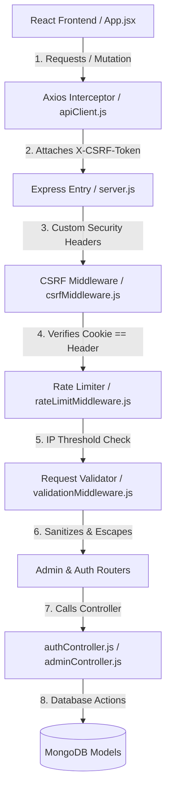

# Jonathan's Modules: Architecture, Security & Admin Core

This document details Jonathan's specific modules of the EduCore LMS application, their CommonJS architecture, crucial security implementations, database models, frontend contexts, pages, configurations, and a guide for demo/viva preparation.

---

## 🗺️ 1. Executive Summary & Big Picture

In the lifecycle of a modern web application, security and administration form the foundational bedrock. These parts represent the structural architecture and core administrative machinery of the EduCore LMS. Without this framework, the application would have no session security, no defenses against malicious automation, no request validation, and the system administrator would have no way to brand or configure the application.

### What Problem This Code Solves

1. **Access Controls & Sessions**: Prevents anonymous users from reading or writing data. It sets up session cookies that the browser hides from scripts, blocking session hijacking.
2. **Defensive Shielding**: Exposes rate-limiting rules to choke brute-force automated login bots, validates all parameters entering our Node/Express environment, and prevents Cross-Site Request Forgery (CSRF) exploits.
3. **Admin Controls**: Provides the administrative backend to edit SMTP mail routes, manage courses, render platform system health logs, compile database storage capacity data, and upload the university logo.
4. **UX Cohesion**: Supplies a central toaster system to broadcast user updates across asynchronous pages and sets up loading skeleton assets.

### How Frontend and Backend Connect

The communication loop is built on top of `apiClient.js` (the Axios setup) and Express routes:

- **Authentication**: The login form submits credentials via `apiClient.post('/api/auth/login')`. The backend validates the inputs, hashes the password, and replies with user metadata, setting the secure `jwt` session cookie and `csrf-token` cookie in the browser.
- **State Updates**: The client uses `apiClient` for all CRUD tasks. For example, `SystemSettingsPage.jsx` makes a `PUT /api/admin/settings` call. Since this changes server state, the Axios interceptor reads the `csrf-token` cookie and appends it as the `X-CSRF-Token` header. The Express server matches these cookies/headers before running the controller.
- **Branding Pipeline**: The admin uploads a branding image. This sends a multipart form to `POST /api/admin/upload/logo`. The backend saves the image files using `multer` to `/uploads`, returns the image url path, and updates the `SystemSetting` DB collection.

### How This Code Interacts with Colleagues' Parts

These modules provide the platform framework that other modules depend on:

1. **Yassin's User Management & Course Roster**: When Yassin's panel creates or deactivates students or instructors, the request flows through my validation rules and utilizes the database schemas.
2. **Basel's Messaging & Notifications**: Basel's real-time messaging page uses my `ToastContext` hook to alert users when a message is successfully delivered, read, or deleted. His APIs also run behind my HTTPOnly verification wrapper.
3. **Seliem's & Magdy's Portals**: When Seliem posts a new course or Magdy registers, they make requests that are protected by my rate-limiting middleware, CSRF validations, and token verifications.

### Architecture and Data-Flow Diagram



---

## 🗂️ 2. File Inventory & Feature Map

### Complete File Inventory

The following files are owned/authored by Jonathan:

- **Backend Controllers & Routes** (Structured using CommonJS `require` imports and `module.exports`):
  - `authController.js`
  - `adminController.js`
  - `authRoutes.js`
  - `adminRoutes.js`
  - `userRoutes.js`
- **Backend Middleware**:
  - `authMiddleware.js` (Shared access check, plus `studentOnly` and HOD guards)
  - `csrfMiddleware.js`
  - `rateLimitMiddleware.js`
  - `validationMiddleware.js`
  - `uploadMiddleware.js` (Shared file upload configurations, including assignment files and Seliem's material upload configuration)
- **Backend Models**:
  - `Admin.js`
  - `SystemLog.js`
  - `SystemSetting.js`
  - `EmailTemplate.js`
- **Frontend Pages & Contexts** (Vite JSX/JS compiled files using ES Modules standard for client-side bundle efficiency):
  - `ToastContext.jsx`
  - `SettingsContext.jsx` (Global settings provider, DOM class/direction selector, and translations hook helper)
  - `translations.js` (Arabic/English localized strings dictionaries)
  - `apiClient.js`
  - `AdminDashboard.jsx`
  - `SystemLogsPage.jsx`
  - `SystemSettingsPage.jsx`
  - `EmailTemplatesPage.jsx`
  - `AdminReportsPage.jsx`
  - `CourseManagementPage.jsx`
  - `Skeleton.jsx`
- **SSL Certificates & Configuration**:
  - `generate-certs.js`
  - `vite.config.js`
- **Core Server Config**:
  - `server.js` (Shared security configurations and middleware registrations)

### Detailed Feature Maps (Your Part vs. Other Parts)

If the professor asks about any topic in the "Not Your Part" column, state: **"This part was implemented by my colleague; they can explain their files and architecture."**

| System Domain                | 🔐 YOUR Part (Jonathan)                                                                                                                                                                                        | ❌ NOT Your Part (Colleagues)                                                    |
| :--------------------------- | :------------------------------------------------------------------------------------------------------------------------------------------------------------------------------------------------------------- | :------------------------------------------------------------------------------- |
| **Authentication**           | JWT creation, Secure HTTPOnly cookie setup, Session validations (`GET /api/auth/me` — supports HOD validation checks), and global duplicate account checks returning "user already exists". | Student/Instructor model routing logic (handled by Yassin).                      |
| **Security Middlewares**     | CSRF Double-Submit token check (`csrfMiddleware.js`), Auth rate limiters (`rateLimitMiddleware.js`), and Role verification guards like `studentOnly` and `head_of_department` checks in (`authMiddleware.js`). | General token decryption wrapper (`authMiddleware.js` - shared).                 |
| **Input Sanitization**       | `express-validator` setup inside validation middleware (`validationMiddleware.js`), String escaping.                                                                                                           | Routing validations for courses/materials (handled by course owners).            |
| **Admin Configurations**     | Global system configuration (`SystemSettingsPage`), SMTP email template editors, file uploading logic.                                                                                                         | Roster management / User creation panel (handled by Yassin).                     |
| **Common UI Elements**       | Global `<ToastProvider />` and central alert contexts, `<Skeleton />` loaders, and Sidebar layout upgrades (logout trigger integration and active link shadowing / scaling animations).                        | Custom page styles, dashboard views for students (Magdy) & instructors (Seliem). |
| **Analytics & System Audit** | Platform statistics overview (`AdminDashboard.jsx`), audit log database logs (`SystemLogsPage.jsx`).                                                                                                           | Roster lists, course lists, discussion boards, message forms (Basel).            |
| **Localizations & Themes**   | Global multi-language (English/Arabic) dictionary, layout direction toggler (RTL/LTR), and Light/Dark mode transitions (utilizing Tailwind v4 class-based variants and localStorage persistence).              | Custom profile fields or bio validations (handled by respective roles).          |

---

## 🔍 3. Master Deep-Dive Reference (Files & Syntax)

This section provides a unified, file-by-file breakdown of your parts of the codebase, explaining their purpose, internal logic, syntax, functions, and critical components to understand.

### A. Backend Core & Middleware

#### 📄 `backend/server.js`

- **Purpose**: Initializes the Express app, registers security headers, manages the database connection, handles the auto-generation of SSL certificates, and boots the backend over secure HTTPS on port 5000.
- **Key Logic & Syntax**:
  - `const express = require('express');` - Standard CommonJS module import for the Express framework.
  - `const https = require('https');` - Core Node.js module used to start the secure server instance.
  - `app.use(cors({ origin: process.env.FRONTEND_URL || 'https://localhost:5173', credentials: true }));` - Configures Cross-Origin Resource Sharing (CORS). `credentials: true` is crucial because it allows the client browser to transmit and receive the secure `httpOnly` JWT session cookie.
  - `app.use((req, res, next) => { res.setHeader('X-Frame-Options', 'DENY'); ... next(); });` - Custom middleware injecting security response headers to protect users from Clickjacking (DENY), MIME sniffing (nosniff), and XSS (mode=block) exploits.
  - `mongoose.connect(process.env.MONGODB_URI)` - Establishes the database connection using Mongoose.
  - `selfsigned.generate(attrs, opts)` - An asynchronous call triggered at boot if `key.pem` or `cert.pem` are missing. It programmatically generates a 2048-bit keypair and a self-signed certificate, which are saved in the `certs/` folder.
  - `https.createServer(sslOptions, app).listen(PORT, ...)` - Bootstraps the Express application within a native Node.js HTTPS server, routing all requests securely over TLS on port 5000.

#### 📄 `backend/middleware/csrfMiddleware.js`

- **Purpose**: Generates random CSRF tokens for clients and verifies matching token headers for state-changing requests using the Double-Submit Cookie pattern.
- **Key Logic & Syntax**:
  - `setCsrfCookie`: Checks if an incoming browser request contains a cookie named `csrf-token`. If not, it uses Node's native `crypto` module to generate a random 32-byte hexadecimal string and writes it to a non-HTTPOnly cookie called `csrf-token` (which the frontend code can read).
  - `verifyCsrf`: Examines the request method. If it is a safe method (`GET`, `HEAD`, `OPTIONS`), it bypasses validation. It also bypasses checks for initial authentication routes (`/api/auth/login`, `/api/auth/register`, `/api/auth/logout`) so sessions can establish. For other unsafe methods (`POST`, `PUT`, `DELETE`), it compares the `csrf-token` cookie with the `x-csrf-token` request header. If they don't match, it returns a `403 Forbidden` response:
    ```javascript
    const csrfToken = req.headers["x-csrf-token"];
    const cookieToken = req.cookies["csrf-token"];
    if (!csrfToken || csrfToken !== cookieToken) {
      return res.status(403).json({ message: "CSRF token validation failed" });
    }
    ```
  - **Tricky Part**: The `csrf-token` cookie has `httpOnly: false` so that the client-side JavaScript interceptor can read the token. The `jwt` cookie remains `httpOnly: true`. This separation is a crucial security pattern.

#### 📄 `backend/middleware/rateLimitMiddleware.js`

- **Purpose**: Safeguards authentication endpoints from brute-force password attacks by throttling requests.
- **Key Logic & Syntax**:
  - Maintains an in-memory `Map` (`ipTracker` / `ipRequestCounts`) tracking the active request timestamps for caller IP addresses.
  - Captures the client IP (`req.ip`), registers the current timestamp (`Date.now()`), and filters out any historical timestamps older than the 15-minute window (`windowMs` = 15 mins).
  - `if (requests.length > 100) { return res.status(429).json({ message: 'Too many requests' }); }` - Returns a `429 Too Many Requests` error if an IP has executed more than 100 requests in 15 minutes, blocking further execution.
  - **Where configured**: The specific limit of **100 requests per 15 minutes** is configured and passed to the middleware during instantiation inside `backend/routes/authRoutes.js`, where `windowMs` is set to `15 * 60 * 1000` and `maxRequests` is set to `100`.
  - **Viva Alert**: Memory Leak Risk: In production, using a local memory map `ipRequestCounts` can lead to memory exhaustion under distributed attacks. In production, this should be replaced with a distributed cache like Redis.

#### 📄 `backend/middleware/validationMiddleware.js`

- **Purpose**: Verifies that input payloads conform to exact format specifications and sanitizes string fields.
- **Key Logic & Syntax**:
  - Uses `express-validator` rules. For registrations, it verifies the email format, ensures the password is at least 6 characters, validates that the role is either 'student' or 'instructor' (specifically preventing 'admin' role registration), and uses `.trim().escape()` to strip out HTML tags or script injection strings.
  - If validation checks fail, `validateRequest` intercepts the flow and immediately returns an HTTP `400 Bad Request` containing an array of validation error messages.

#### 📄 `backend/middleware/uploadMiddleware.js`

- **Purpose**: Configures file storage and type filtering rules using `multer` for all file upload endpoints in the system.
- **Key Logic & Syntax**:
  - Automatically creates destination folders (`uploads/`, `uploads/submissions/`, and `uploads/materials/`) if they do not exist using `fs.mkdirSync`.
  - Configures unique, collision-proof file renaming by prefixing file types (e.g., `logo-`, `submission-`, `material-`) and appending `Date.now()` and their lowercase extension names.
  - Registers 4 distinct middleware configurations to enforce safety constraints:
    1. **`uploadLogo`**: Restricts size to **2MB** and requires image formats (`image/*`). Used in `adminRoutes.js` for custom school branding logo updates.
    2. **`uploadAvatar`**: Restricts size to **5MB** and requires image formats (`image/*`). Used in `userRoutes.js` for profile picture updates.
    3. **`uploadAssignment`**: Restricts size to **10MB** and accepts PDF, ZIP, DOC, DOCX, and images. Used in `studentRoutes.js` for submitting homework deliverables.
    4. **`uploadFile`**: Restricts size to **100MB** and accepts PDF, MP4, DOC, DOCX, PPT, and PPTX. Used in `instructorRoutes.js` for uploading syllabus materials and lecture videos.
  - **Structure**:
    ```javascript
    const storage = multer.diskStorage({
      destination: (req, file, callback) => {
        callback(null, "path/to/folder");
      },
      filename: (req, file, callback) => {
        callback(null, "custom-filename.ext");
      },
    });
    const fileFilter = (req, file, callback) => {
      if (file.mimetype.startsWith("image/")) {
        callback(null, true);
      } else {
        callback(new Error("Rejected!"), false);
      }
    };
    ```

#### 📄 `backend/middleware/authMiddleware.js`

- **Purpose**: Validates stateless cookie-based JWT sessions, checks if the account is active, and enforces role restrictions on secure routes.
- **Key Logic & Syntax**:
  - `const token = req.cookies.jwt;` - Extracts the JSON Web Token directly from the secure incoming cookies.
  - `const decoded = jwt.verify(token, process.env.JWT_SECRET);` - Verifies the signature of the token against the backend `JWT_SECRET`. If it is corrupted or expired, it throws an error, returning `401 Unauthorized`.
  - `req.user = await Model.findById(decoded.id).select('-password');` - Resolves the user document from MongoDB (checking Admins, Instructors, or Students) and binds it to the request object.
  - `if (!user || user.isActive === false)` - Automatically intercepts requests from deactivated users and denies access with a `401` status to block access immediately.
  - `const studentOnly = (req, res, next) => { if (req.user.role !== 'student') return res.status(403)... };` - Route guard checking the injected `req.user.role`. If the user is unauthorized, it terminates the call with `403 Forbidden` before hitting any controllers.

---

### B. Backend Controllers & Models

#### 📄 `backend/controllers/authController.js`

- **Purpose**: Authenticates user credentials, signs session tokens, sets secure cookies, handles current session checks, and enforces status/active verifications.
- **Key Functions**:
  - `registerUser`: Decides which user model to query based on `role` (Instructor, Student; Admin registration is explicitly prohibited and rejected here). It queries all user collections (Student, Instructor, and Admin) by email to prevent duplicate accounts and returns `"user already exists"` if a match is found. It then hashes the password using `bcryptjs`, saves the record, generates a JWT, and sets it in the cookie.
  - `loginUser`: Locates the user by email, compares the password with `bcrypt.compare()`, generates a JWT, sets the cookie, and returns the basic user profile object.
  - `checkSession` (`GET /api/auth/me`): Verifies the logged-in user by decoding the JWT from their cookies, returning active profile data. If they hold the `head_of_department` instructor status, it dynamically looks up their department.
  - **Token Signing**: Utilizes `generateToken` helper function to sign a payload (user ID and role) using `jwt.sign` with a 1-day expiration time (`expiresIn: '1d'`) and the secret key `process.env.JWT_SECRET`:
    ```javascript
    const generateToken = (id, role) => {
      return jwt.sign({ id, role }, process.env.JWT_SECRET, {
        expiresIn: "1d",
      });
    };
    ```
  - **Secure Token Cookie Injection**: Uses the helper `setCookieToken` to write the signed JWT into a client cookie named `jwt`. It applies strict flags (`httpOnly` to prevent XSS read access, `sameSite: 'strict'` to prevent CSRF exploits, and `secure` in production):
    ```javascript
    res.cookie("jwt", token, {
      httpOnly: true,
      sameSite: "strict",
      secure: process.env.NODE_ENV === "production",
      maxAge: 24 * 60 * 60 * 1000, // 1 day
    });
    ```
  - `res.clearCookie('jwt');` - Deletes the session cookie from the client's browser to execute a secure logout.

#### 📄 `backend/controllers/adminController.js`

- **Purpose**: Provides administrative CRUD utilities, compiles log histories, generates report statistics, and manages settings.
- **Key Functions**:
  - `getSystemLogs`: Returns a paginated list of logs sorted by date.
  - `getPlatformAnalytics`: Aggregates the counts of database documents to show total students, instructors, and courses. It queries only active, non-deactivated administrators, instructors, and students via `isActive: { $ne: false }` to populate exact platform growth counters.
  - `getAdminReports`: Aggregates enrollment status ratios and calculates average grades by converting letter grades to points.
  - `uploadLogoFile`: Processes logo images uploaded via `multer` and saves the file URL to settings:
    ```javascript
    const uploadLogoFile = async (req, res) => {
      try {
        if (!req.file)
          return res.status(400).json({ message: "No file uploaded." });
        const logoUrl = `/uploads/${req.file.filename}`;
        let settings = await SystemSetting.findOne({});
        if (!settings) settings = new SystemSetting({});
        settings.logoUrl = logoUrl;
        await settings.save();
        res.json({ logoUrl, message: "Logo uploaded successfully" });
      } catch (error) {
        res.status(500).json({ message: error.message });
      }
    };
    ```

#### 📄 `backend/models/SystemSetting.js`, `Admin.js`, `SystemLog.js`, `EmailTemplate.js`

- **Purpose**: These Mongoose schemas structure administrative data:
  - `SystemSetting`: Stores platform configurations (SMTP settings, branding logo URL).
  - `SystemLog`: Stores informational, warning, or error logs for audit trails.
  - `EmailTemplate`: Stores subject lines and body HTML markup for system notifications.
  - `Admin`: Structures system administrator credentials and permissions.
    - **Pre-Save Middleware (`adminSchema.pre('save')`)**: Before an Admin document is saved to MongoDB, this pre-save hook runs automatically to perform two processes:
      1. **Initials Generation**: If no initials are provided, it splits `full_name` by spaces, extracts the first letter of each word, joins them, converts them to uppercase, and slices the output to a maximum of 2 characters (e.g., `"John Doe"` becomes `"JD"`).
      2. **Automatic Bcrypt Hashing**: It checks if the password field has been modified using `this.isModified('password')`. If modified, it hashes the plain-text password with `bcrypt.genSalt(10)` and secures it before writing to MongoDB.

---

### C. Backend Route Definitions

#### 📄 `backend/routes/authRoutes.js`

- **Purpose**: Establishes endpoints for user onboarding, session verification, and logouts.
- **Key Logic**:
  - Instantiates `authLimiter` to restrict IP requests to 100 requests per 15 minutes, protecting `/register` and `/login` from brute-force scripts.
  - Exposes:
    - `POST /register`: Creates a new profile after running validation rules.
    - `POST /login`: Validates inputs and logs the user in.
    - `POST /logout`: Clears the secure `jwt` session cookie on the client browser.
    - `GET /me`: Verifies the active session and returns the logged-in user's profile metadata.

#### 📄 `backend/routes/adminRoutes.js`

- **Purpose**: Defines administrative control paths for system settings, log auditing, analytics, and user governance.
- **Key Logic**:
  - Runs `protect` (session verify) and `admin` (role guard) middlewares globally on the router, blocking any non-admin users from accessing these endpoints.
  - Exposes routes for:
    - Log auditing (`GET /logs`) and system-wide analytics (`GET /analytics`).
    - Modifying configurations (`GET/PUT /settings`) and creating system broadcasts (`POST /broadcast`).
    - CRUD operations on email templates (`/email-templates`).
    - User Governance operations: listing all accounts (`GET /users`), creating users, and updating or deactivating users.
    - Logo Upload: `POST /upload/logo` runs the `uploadLogo` Multer middleware before calling the controller to save the branding path.

#### 📄 `backend/routes/userRoutes.js`

- **Purpose**: Exposes endpoints for general user actions (like updating profile pictures).
- **Key Logic**:
  - Runs the `protect` session validation middleware.
  - Exposes `PUT /profile/avatar` which uses the `uploadAvatar` Multer middleware (restricting files to images under 5MB) and updates the matching database document (`Student`, `Instructor`, or `Admin`) with the path to the saved avatar image.

---

### E. Frontend Contexts, Pages & UI Utilities

#### 📄 `frontend/src/lib/apiClient.js`

- **Purpose**: Sets up a pre-configured Axios instance to communicate with the backend, automatically sending credentials and attaching CSRF tokens.
- **What Axios is & What it does**: Axios is a promise-based HTTP client library that makes asynchronous REST API calls. It handles JSON serialization/deserialization automatically and supports global interceptors to preprocess requests.
- **Key Logic & Syntax**:
  - **`withCredentials: true` Configuration**: This option is passed to `axios.create()`. It instructs the browser to automatically include the secure `httpOnly` JWT session cookie on every outgoing API request.
  - **CSRF Request Interceptor**: Automatically parses the browser's cookies for a `csrf-token` value and injects it as an `X-CSRF-Token` header on mutating write requests (`POST`, `PUT`, `DELETE`, `PATCH`):
    ```javascript
    apiClient.interceptors.request.use((config) => {
      const token = getCookie("csrf-token");
      if (token && ["post", "put", "delete", "patch"].includes(config.method)) {
        config.headers["X-CSRF-Token"] = token;
      }
      return config;
    });
    ```

#### 📄 `frontend/src/context/ToastContext.jsx`

- **Purpose**: Manages global toast alerts across the application using React Context API.
- **Key Logic & Syntax**:
  - **Context Creation & Hook**: Creates `ToastContext` and exposes the `useToast` custom hook which checks if it's being used within the `ToastProvider` context.
  - **State Management**: The `ToastProvider` keeps an array of active toasts in a state variable (`toasts`).
  - **Adding Toasts**: The `showToast` function is memoized via `useCallback` to prevent unnecessary renders. It generates a unique ID using `Date.now()` combined with a base-36 random string and appends the new toast object to the state with its message and type (defaults to `'success'`).
  - **Removing Toasts**: The `removeToast` function is also memoized and filters out the dismissed toast by its ID.
  - **Global Stacked Container**: Renders a fixed container at the bottom-right of the screen (`fixed bottom-8 right-8 z-[200]`). It uses `pointer-events-none` so mouse clicks can pass through the layout, while individual toast items use `pointer-events-auto`.
  - **Self-Dismissal & Cleanup**: The `ToastItem` component triggers a 3.5-second (3500ms) auto-dismiss timeout inside a `useEffect` hook. If a toast is manually closed or unmounted early, it clears the timeout (`clearTimeout`) to avoid memory leaks.
  - **Dynamic Styling & Icons**: Combines baseline glassmorphism/fade-in animation classes with type-specific styling:
    - **Success**: Emerald green background (`bg-emerald-500/90 border-emerald-400/30`) with a `check_circle` icon.
    - **Error**: Rose red background (`bg-rose-500/90 border-rose-400/30`) with an `error` icon.
    - Includes a manual dismiss button utilizing a `close` Material Symbols icon.

#### 📄 `frontend/src/components/ui/Skeleton.jsx`

- **Purpose**: Provides a reusable shimmering loading screen element.
- **Key Logic & Syntax**:
  - Renders a blank CSS-based layout utilizing an animation class (`animate-pulse`) to show a pulsing grey template block while actual content is being fetched.

#### 📄 `frontend/src/components/ui/` (`Button.jsx`, `Card.jsx`, `Input.jsx`)

- **Purpose**: Base elements defining your system design tokens on the frontend.
- **Key Logic**:
  - **Button**: A reusable utility wrapper that supports style themes (primary background colors, borders) and disabled states.
  - **Card**: Standardized layout box that implements dark transparency backing (`bg-slate-900/50`) and glass border transitions.
  - **Input**: Configures form inputs with custom labels, focus effects, and validation alert border styles.

#### 📄 `frontend/src/components/ProtectedRoute.jsx`

- **Purpose**: Guards frontend paths by validating user credentials and roles.
- **Key Logic**:
  - Calls `useAuth()` to check if the user is authenticated. If the user object is missing, it cancels loading and forces a redirect to the `/login` route.
  - If the user role is active but not listed in the route's `allowedRoles` array (e.g. a student navigating to `/admin/settings`), it redirects them to `/unauthorized`.
  - Otherwise, it renders `<Outlet />` allowing the browser to proceed to the targeted child page view.

#### 📄 `frontend/src/pages/auth/` (`LoginPage.jsx`, `RegisterPage.jsx`)

- **Purpose**: Provides registration and credential forms for user onboarding.
- **Key Logic**:
  - Forms check input rules (empty fields, short passwords) locally. Note that `RegisterPage.jsx` does not allow selecting the Admin role; only Student and Instructor roles can be created publicly.
  - Submits registration and login credentials payloads via Axios to the backend `/api/auth/` controllers.
  - Integrates with the global Toast system to flash notifications upon success or error, and updates the shared authentication context.

#### 📄 `frontend/src/pages/LandingPage.jsx`

- **Purpose**: Serves as the landing presentation portal of the platform.
- **Key Logic**:
  - Displays features, stats, and testimonials.
  - Implements a custom `useCounter` React hook: when the user scrolls past 80% of the screen height, it triggers an animation that counts up the stats values (e.g., _12,840+ Active Students_) dynamically over 2 seconds.
  - Uses CSS media queries and backdrop-blur styling to serve responsive grid lists.

#### 📄 `frontend/src/pages/admin/SystemSettingsPage.jsx`

- **Purpose**: Renders the form for administrators to edit global configurations, SMTP credentials, and upload a custom logo.
- **Key Logic**:
  - Fetches current settings on mount. When the form is submitted, it validates inputs, constructs request payloads, and uses `apiClient.put` to update the settings.
  - For logo uploads, it handles the file select event, builds a `FormData` payload, and posts to the file upload route.

#### 📄 `frontend/src/pages/admin/SystemLogsPage.jsx`

- **Purpose**: Audit logs viewer; implements filterable log lists and dynamic client-side CSV downloads.
- **Key Logic & CSV Exporter**:
  - The `exportToCSV` function formats database log documents and prompts a download:

    ```javascript
    const exportToCSV = () => {
      if (!logs || logs.length === 0) {
        showToast(t("noLogsExport"), "error");
        return;
      }
      const headers = ["Timestamp", "Level", "Message", "Context"];
      const rows = logs.map((log) => [
        new Date(log.timestamp).toLocaleString(),
        log.level.toUpperCase(),
        `"${log.message.replace(/"/g, '""')}"`,
        log.context ? `"${log.context.replace(/"/g, '""')}"` : "",
      ]);
      const csvContent = [
        headers.join(","),
        ...rows.map((row) => row.join(",")),
      ].join("\n");

      const blob = new Blob([csvContent], { type: "text/csv;charset=utf-8;" });
      const url = URL.createObjectURL(blob);
      const link = document.createElement("a");
      link.setAttribute("href", url);
      link.setAttribute("download", `system_audit_logs_${Date.now()}.csv`);
      link.style.visibility = "hidden";
      document.body.appendChild(link);
      link.click();
      document.body.removeChild(link);
    };
    ```

#### 📄 `frontend/src/context/SettingsContext.jsx` & `translations.js`

- **Purpose**: Provides global React state context to manage light/dark theme toggles and LTR/RTL multi-language preferences. Fetches the active logo from the backend on initialization.
- **Key Logic & Syntax**:
  - `document.documentElement.dir = language === 'ar' ? 'rtl' : 'ltr';` - Manipulates the root HTML node's text direction dynamically. When Arabic is active, setting it to `rtl` instructs the browser to flip layouts automatically.
  - `document.documentElement.classList.toggle('dark', theme === 'dark');` - Manipulates the root DOM classes. Tailwind v4 reads this class to toggle custom dark variant styles dynamically.
  - `const t = (key) => translations[language][key] || key;` - A translation lookup function that takes a localization key and returns the corresponding translated string from the dictionary map.
  - **Unauthenticated Logo Endpoint integration**:
    ```javascript
    const [logoUrl, setLogoUrl] = useState("");
    useEffect(() => {
      const fetchLogo = async () => {
        try {
          const { data } = await apiClient.get("/api/logo");
          if (data.logoUrl) setLogoUrl(data.logoUrl);
        } catch (err) {
          /* Graceful failure */
        }
      };
      fetchLogo();
    }, []);
    ```

#### 📄 `frontend/vite.config.js` & `backend/certs/generate-certs.js`

- **Purpose**: Configures the local development servers to operate exclusively over secure TLS channels.
- **DRY Refactoring**: In addition to operating as a CLI utility, the certificate generator script `generate-certs.js` is imported and called directly by `server.js` at startup to create certificates if missing, resolving duplicate code redundancies.
- **Key Logic**:
  - `selfsigned.generate(attrs, opts)` - Uses the pure JS WebCrypto API to dynamically generate local RSA SSL certificate keypairs (`key.pem`) and certificates (`cert.pem`) for `localhost` and `127.0.0.1`.
  - `server: { https: { key: fs.readFileSync(...), cert: fs.readFileSync(...) } }` - Binds Vite's local HTTP server to the certificates generated by the backend, launching the React app on `https://localhost:5173`.
  - `fs.existsSync(keyPath)` - Safely checks for the existence of certificates, allowing Vite to fall back gracefully to standard HTTP rather than crashing if the keys are not yet created.

#### 📄 `frontend/index.html`

- **Purpose**: Acts as the browser's entry point for loading the React SPA client in a Vite-based environment.
- **Key Logic**:
  - `<div id="root"></div>` - The critical mount point node where the React application tree binds and renders the virtual DOM.
  - `<script type="module" src="/src/main.jsx"></script>` - Directs Vite to load `main.jsx` as a native ES Module.
  - `<meta name="viewport" content="width=device-width, initial-scale=1.0" />` - Standard viewport configuration, ensuring mobile responsive styles render accurately.

#### 📄 `frontend/src/main.jsx`

- **Purpose**: Serves as the JavaScript entry point loaded directly by `index.html`. It boots React, binds it to the root DOM node, and mounts the React application tree.
- **Key Logic**:
  - `import ReactDOM from 'react-dom/client';` - Imports the React DOM compiler.
  - `ReactDOM.createRoot(document.getElementById('root')).render(...)` - Queries the `root` div element from `index.html` and initializes React's Virtual DOM rendering tree within it.
  - `<BrowserRouter>` - Wraps the routing tree to allow HTML5 History API routing natively.

#### 📄 `frontend/src/App.jsx`

- **Purpose**: Defines the global React component tree, wraps routes with context providers, and declares routes with role-based access controls.
- **Key Logic**:
  - `AuthProvider`, `ToastProvider`, `SettingsProvider` - Globally wraps the entire route tree so that authentication, notification popups, and localized configurations are accessible from any child view.
  - `Routes` & `Route` - Declares client-side paths mapped to pages.
  - `Route element={ProtectedRoute allowedRoles={['admin']} /}` - Checks the user's role before rendering the sub-routes (e.g., `/admin`, `/admin/users`, `/admin/settings`). If unauthorized, it redirects to the `/unauthorized` view.

#### 📄 `frontend/src/styles/index.css`

- **Purpose**: Defines application-wide visual baselines, custom transitions, scrollbars, and configures Tailwind CSS v4 class-based dark mode variants.
- **Key Logic**:
  - `@import "tailwindcss";` - Imports the default utility classes, variables, and directives of the Tailwind CSS framework.
  - `@custom-variant dark (&:where(.dark, .dark *));` - Defines a custom Tailwind CSS v4 compile-time variant. This maps `dark:` classes to look for the presence of the `.dark` class selector on the root `<html>` element rather than querying the system's media preference, enabling manual toggles.
  - All styles reside strictly in external `.css` files, avoiding inline style blocks.

---

## 📂 4. Folder Structure & MVC Architecture

Here is the explanation of each folder in the repository and how they relate to the Model-View-Controller (MVC) architecture and Jonathan's specific parts:

### Backend Structure (`backend/`)

- **`controllers/`**: Contains the main logical handlers for the REST API. This is the **Controller** layer of MVC. For Jonathan, this includes `authController.js` (login/session checks) and `adminController.js` (system settings, dashboards).
- **`models/`**: Houses Mongoose database schemas defining document structures. This is the **Model** layer of MVC. For Jonathan, this includes `Admin.js`, `SystemSetting.js`, `SystemLog.js`, and `EmailTemplate.js`.
- **`middleware/`**: Functions that run sequentially before reaching controllers (e.g., rate-limiters, CSRF checkers, validation parser, auth check).
- **`routes/`**: Declares endpoints and maps URL paths to controllers. Part of the controller routing layer of MVC.
- **`certs/`**: Dedicated folder storing local SSL keypairs (`key.pem`) and certificates (`cert.pem`) generated programmatically for HTTPS support.
- **`uploads/`**: Stores static media files such as branding logo files and assignment submission files.
- **`services/`**: Holds database operational helpers or third-party service abstractions (like `userService.js`).
- **`utils/`**: Shared general scripts, including the database seeder (`seedData.js`) and diagnostics scripts inside `utils/scratch/`.

### Frontend Structure (`frontend/`)

- **`src/pages/`**: Contains React page components representing the frontend views. This is the **View** layer of MVC. For Jonathan, this includes the `admin/` folder views (Dashboard, settings, logs).
- **`src/components/`**: Houses reusable UI components (e.g. Buttons, Inputs, skeletons, layouts) shared across pages.
- **`src/context/`**: Manages global React states using Context API (like Toast system, auth context, or theme settings).
- **`src/lib/`**: Contains third-party clients and dictionary helper code (like `translations.js` or `apiClient.js` axios instance).
- **`src/styles/`**: Holds stylesheets including the main `index.css` configured for Tailwind CSS v4.

---

## 🎨 5. Architectural & Technical Decisions

### 1. CommonJS (CJS) vs. ES Modules (ESM) in EduCore

This table illustrates the core module architectural division:

| Layer                      | Module Standard      | Technical Rationale                                                                                                                                 |
| :------------------------- | :------------------- | :-------------------------------------------------------------------------------------------------------------------------------------------------- |
| **Frontend (`frontend/`)** | **ES Modules (ESM)** | Standard for React + Vite. Enables browser-native module loading, on-demand dev compilation, and compile-time dead-code elimination (tree-shaking). |
| **Backend (`backend/`)**   | **CommonJS (CJS)**   | Standard for Node.js + Express.js. Runs synchronously without compile steps or loaders, offering high stability and compatibility with Express.     |

- **Why the Frontend React App MUST Remain ES Modules (ESM)**: Vite serves the frontend source files directly as native browser ES Modules. Web browsers do not support CommonJS `require()` natively. Attempting to convert JSX React code to use `require()` will throw runtime exceptions in the browser. Static imports (`import`/`export`) are statically analysable, enabling tree-shaking optimizations during build (`npm run build`).
- **Why the Backend Express App Is Standardized on CommonJS (CJS)**: CommonJS is natively and synchronously supported by the Node.js runtime. Routes, models, and controllers are resolved in order on server initialization without requiring transpilers (like Babel) or ESM loader configs. Traditional Express middlewares and database drivers are fully matured under the CommonJS ecosystem, providing a stable foundation.
- **The Certificate Generator Conversion (`generate-certs.js`)**: The certificate generator script `generate-certs.js` has been rewritten in pure CommonJS to align with the backend's module standard and refactored to export its generation logic. It wraps the asynchronous `selfsigned` generation inside a standard async function, removing module-type mismatch warnings and allowing execution directly via `node certs/generate-certs.js`. It is also imported directly by `server.js` to generate certificates on startup, resolving duplicate code redundancies.

### 2. Process-Wide Access to Environment Variables (JWT Secret, etc.)

Even though security tokens (like `JWT_SECRET`) and configuration keys are only defined in the local `.env` file, they are read and referenced by every module inside the backend. This is made possible by the following mechanisms:

- **Centralized Initialization**: At the absolute entry point of the server (`backend/server.js`), the `dotenv` module is imported and configured immediately:
  ```javascript
  const dotenv = require("dotenv");
  dotenv.config();
  ```
- **Process Environment Binding**: The `dotenv.config()` method reads the raw text of the `.env` file, parses its key-value pairs, and dynamically binds them to Node's native `process.env` global object.
- **Node's Global Namespace**: The `process` object is a global variable provided by the Node.js runtime environment, meaning it is accessible to every script running in the active process. Because `dotenv.config()` executes before any other application modules are required, any nested module (e.g., controllers, database models, middlewares) can access these values directly using `process.env.JWT_SECRET` without needing to individually reload the `.env` configuration file.

### 3. Why We Cannot Use EJS With React as Our Frontend

We cannot combine EJS templates with React on the frontend because they represent two fundamentally conflicting UI architectures:

- **Server-Side Rendered Templates (EJS)**: EJS (Embedded JavaScript) compiles pages entirely on the Node.js backend. Every time a user navigates to a new page, the server receives the HTTP request, compiles the template with server data, builds a raw static HTML file, and sends it down to the browser.
- **Client-Side Single-Page Applications (React)**: React is a client-side component library that runs inside the user's browser. It serves a single shell HTML page and downloads a compiled JavaScript bundle. React dynamically updates the browser's Document Object Model (DOM) using a virtual representation (Virtual DOM) based on client-side state changes, rendering UI updates instantly without requiring server-side page reloads.
- **The Lifecycle Collision**: Combining EJS and React causes a direct collision. EJS expects to serve fully formed static HTML layouts directly from the server, while React expects to mount onto a blank root element and take complete ownership of the DOM tree. Injecting React code inside EJS templates breaks React's runtime reconciliation engine, client-side React Router navigation, and state hook synchronization.
- **Decoupled Architecture**: To harness the strengths of both technologies, we chose a fully decoupled design:
  - **Frontend**: A client-side React Single Page Application (SPA) built and compiled using Vite (configured with standard ES Modules syntax like `import`/`export`).
  - **Backend**: A headless, stateless JSON REST API built with Node/Express (configured using CommonJS module syntax like `require` and `module.exports`).
- **The Connection to CommonJS**: Since the frontend React SPA is completely separate, the backend server does not need to render HTML pages, eliminating template engines like EJS entirely. The Express server acts strictly as a raw JSON API. In this decoupled Node API setup, **CommonJS** (`require`/`module.exports`) was chosen for backend module management because:
  - It is natively supported by Node.js, requiring no transpilation, bundlers, or compilation steps (like Babel or TSC) to run on the server.
  - It handles module loading synchronously, which is ideal for server-side environments resolving databases, models, and routes on startup.
  - It offers a highly stable and mature module ecosystem for Express backend architectures.

---

## 📦 6. Dependencies and Running

### 1. Library Dependencies Installed

The application is split into two independent directory trees: the backend API (`backend/`) and the frontend React application (`frontend/`). Each environment has its own dependency manifest.

#### A. Backend Dependencies (Node/Express API)

- **`express`**: The core lightweight web application framework for routing and middleware management.
- **`mongoose`**: An Object Data Modeling (ODM) library for MongoDB, letting us define schemas, validate fields, and handle database relationships.
- **`dotenv`**: Loads environment variables from the `.env` configuration file into the global `process.env` object.
- **`cors`**: Enables Cross-Origin Resource Sharing, allowing our React frontend running on `http://localhost:5173` to safely request data from our Express server.
- **`cookie-parser`**: Parses Cookie headers and populates `req.cookies`, which is critical for reading the secure `jwt` and `csrf-token` session keys.
- **`bcryptjs`**: Cryptographically hashes user passwords with salt rounds before storing them in MongoDB, and handles safe password comparisons during login.
- **`jsonwebtoken`**: Generates and cryptographically signs authentication tokens (JWTs) representing active user sessions.
- **`express-validator`**: An input-sanitization and validation middleware suite used to validate email formats, check text length, and escape potential HTML script injection tags.
- **`multer`**: Parses `multipart/form-data` request bodies, used exclusively for validating and storing custom logo uploads.
- **`selfsigned`**: Generates local SSL certificates on the fly to support secure HTTPS server tests.
- **`nodemon`** _(Development Dependency)_: Automatically monitors backend source files and reboots the Node process whenever a code change is detected.

#### B. Frontend Dependencies (React SPA)

- **`react`** & **`react-dom`**: The UI rendering library and DOM manager for component life cycles.
- **`react-router-dom`**: Handles SPA client-side routing, route protections, and page path mapping.
- **`axios`**: The HTTP client used to request endpoints, configured with interceptors to automatically grab CSRF cookies and pass them as headers.
- **`lucide-react`**: An icon pack providing high-quality, lightweight visual indicators for dashboard menus and alerts.
- **`clsx`** & **`tailwind-merge`**: Utility helpers used to conditionally merge Tailwind CSS classes dynamically without class conflicts.
- **`tailwindcss`**, **`postcss`**, **`autoprefixer`**, **`@tailwindcss/postcss`** _(Development Dependencies)_: The styling engine that compiles and applies custom variables, flex grids, animations, and modern UI styles.
- **`vite`** & **`@vitejs/plugin-react`** _(Development Dependencies)_: The next-generation fast build tool and hot-module reloading local dev server.

---

### 2. Installation Commands Used

To install these modules from scratch, we ran the following terminal commands inside their respective directory folders:

#### Installing Backend Dependencies

Open your terminal, navigate to the `backend/` directory, and execute:

```bash
# Install production libraries
npm install express mongoose dotenv cors cookie-parser bcryptjs jsonwebtoken express-validator multer selfsigned

# Install development tool (Nodemon)
npm install --save-dev nodemon
```

_(Alternatively, if you already have the `package.json` file, running `npm install` inside the `backend/` folder resolves and installs all of these packages automatically.)_

#### Installing Frontend Dependencies

Open your terminal, navigate to the `frontend/` directory, and execute:

```bash
# Install production libraries
npm install axios react-router-dom lucide-react clsx tailwind-merge react react-dom

# Install CSS and build tooling
npm install --save-dev vite @vitejs/plugin-react tailwindcss postcss autoprefixer @tailwindcss/postcss
```

_(Similarly, if the `package.json` file is present, running `npm install` inside the `frontend/` folder automatically downloads and links these packages.)_

---

### 3. How to Start the Project (When Opening Your Laptop)

To launch both the frontend and backend servers concurrently when starting a development session, follow these steps:

#### Step 1: Start the Backend API

1. Open a new terminal window or tab.
2. Navigate to the backend directory:
   ```bash
   cd backend
   ```
3. Run the development script:
   ```bash
   npm run dev
   ```
   _Note: This starts the server on port `5000` (or `5443` for HTTPS if SSL certs are generated). It will dynamically reload when changes are made. Ensure your MongoDB service is running locally or your Atlas URI in the `.env` file is active._

#### Step 2: Seed the Database (Optional / First Run)

If you are running the project for the first time and need to populate local collections with default users (Admin, Instructors, Students) and configuration presets:

1. Keep the backend terminal open, or open a new terminal inside the `backend/` directory.
2. Run the seed script:
   ```bash
   npm run seed
   ```

#### Step 3: Start the Frontend React App

1. Open a separate terminal window or tab (so the backend server continues to run).
2. Navigate to the frontend directory:
   ```bash
   cd frontend
   ```
3. Run the frontend Vite dev server:
   ```bash
   npm run dev
   ```
4. Once running, open your browser and navigate to the address shown in the output (typically `http://localhost:5173`).

---

## 🤝 7. Shared Parts & App.jsx Mapping

### Jonathan's Parts in App.jsx

Inside `App.jsx`, Jonathan is responsible for the overall app wrapper, session contexts, and administrative routes:

1. **Global Context Providers**:
   - AuthProvider : Manages the logged-in session state and makes the active user object accessible throughout the app.
   - ToastProvider : Enables the application-wide popup alert container.
2. **Access Control (Protected Routing)**:
   - ProtectedRoute : The security wrapper that intercepts routes and blocks access if the user's role does not match the page permissions.
3. **Public & Auth Routes**:
   - `/login` (renders `LoginPage`): The portal authentication form.
   - `/register` (renders `RegisterPage`): The user registration form.
4. **Admin Route Group (🔐 Jonathan's Owner Area)**:
   - `/admin` (renders `AdminDashboard`): Platform metrics and growth tracking.
   - `/admin/users` (renders `UserManagementPage`): Governance dashboard.
   - `/admin/logs` (renders `SystemLogsPage`): System logs audit viewer.
   - `/admin/settings` (renders `SystemSettingsPage`): Branding and SMTP configs.
   - `/admin/templates` (renders `EmailTemplatesPage`): System notification editor.
   - `/admin/reports` (renders `AdminReportsPage`): Data aggregation trends.
   - `/admin/courses` (renders `CourseManagementPage`): Global courses directory.

### Shared Parts

These files are shared code infrastructure owned by Jonathan but utilized by the entire team:

- **`server.js`**: The main entry point of the Express API. It registers shared security headers and mounts route prefixes for Seliem's courses, Basel's messages, Magdy's student views, and Yassin's roster endpoints. Note that HOD routes (`/api/instructor/department`) are registered before standard instructor routes to preserve Express route matching precedence.
- **`App.jsx`**: The central React Router file. Used by everyone to map their page URLs to React components. Includes routing configuration for the HOD portal (`/department-head`).
- **`apiClient.js`**: The Axios wrapper. Used by all frontend pages to talk to the backend, automatically appending JWT cookies and CSRF headers. Expanded to include the `getFileUrl` helper path formatting export.
- **`authMiddleware.js`**: Used by all backend routers to decode tokens, extract the authenticated caller's role, and enforce role-based access control. Updated to support HOD role checks.
- **`uploadMiddleware.js`**: Shared file upload service built on `multer` that handles file system uploads. Updated to contain Seliem's `uploadFile` configuration, enabling 100MB lecture file uploads to `/uploads/materials/`.
- **`validationMiddleware.js`**: Holds parameter validation definitions for admin options, user creations, and course registrations.
- **`Sidebar.jsx`**: Shared navigation component upgraded with active route shadows, icon scaling animations, and an auth-hooked logout container.
- **User Models (`Student.js`, `Instructor.js`, `Admin.js`)**: Shared collections that hold user profiles. They are shared because Seliem, Magdy, and Yassin query and display student/instructor profiles, emails, and avatars (which now use the new `profileImage` and `initials` fields). HOD profile configurations are read from and updated to the `Instructor` collection.

---

## 📚 8. Study & Viva Guide

### 🗂️ A. How to Traverse Your Codebase Instantly

If the professor asks you about a specific feature, here is the traversal path you can explain:

1. **Frontend View**: Go to `frontend/src/pages/admin/` or `App.jsx` to trace active router URLs.
2. **API Client Request**: Look in the component for `apiClient.get(...)` or `apiClient.post(...)` to find the exact endpoint URL (e.g., `/api/auth/me` or `/api/admin/settings`).
3. **Backend Route**: Open `backend/routes/` and find the matching file (e.g., `authRoutes.js` or `adminRoutes.js`) to see which controllers handle it.
4. **Backend Controller**: Open `backend/controllers/` and read the controller function (e.g., `loginUser` or `updateSystemSettings`).
5. **Database Model**: Check `backend/models/` for the Mongoose schema (e.g., `Admin.js`, `SystemSetting.js`) to explain how the fields are structured in MongoDB.

### 🔄 B. Step-by-Step Data Flow

#### Example 1: User Logging In (Auth Flow)

```
[Client (LoginPage.jsx)] ---> POST /api/auth/login ---> [Rate Limiter (rateLimitMiddleware.js)]
                                                                    |
                                                           [Input Sanitization]
                                                                    |
                                                           [Controller Login]
                                                                    |
  [Client (Dashboard)]  <--- Responds 200 & JWT Cookie <--- [Generates JWT Token]
```

1. **Frontend Action**: The user enters their email and password on `/login` (`LoginPage.jsx`) and submits the form.
2. **Security Check (Rate Limiting)**: The request hits the backend at `POST /api/auth/login`. It passes through `rateLimitMiddleware.js`. If the IP has made >100 requests in 15 mins, it gets blocked with HTTP 429.
3. **Input Validation**: The request passes through `validationMiddleware.js`. `express-validator` verifies that the email is formatted correctly and the password meets standard length criteria.
4. **Controller Logic**: `authController.js` hashes the password using `bcryptjs` and compares it to the hashed password in MongoDB (`Admin`, `Instructor`, or `Student` model).
5. **Token Generation**: If valid, the server signs a JWT with the user's ID and role using `jsonwebtoken` and places it in an HTTPOnly, SameSite cookie named `jwt`.
6. **CSRF Setup**: The server also sets a `csrf-token` cookie so subsequent modifying requests are authorized.
7. **Frontend Response**: The server sends back user profile data (name, email, role), and the frontend router redirects them to their respective dashboard based on the role.

#### Example 2: Saving Admin Settings (Config Flow)

```
[Client apiClient.js] ---> Reads 'csrf-token' Cookie ---> Injects 'X-CSRF-Token' Header
                                                                       |
[Client Axios Request] ---------------------------------------------> [Express Server]
                                                                       |
[Access Allowed]      <--- Cookie matches Header <--- [csrfMiddleware verifyCsrf]
```

1. **Frontend Action**: Admin changes the school name or SMTP server settings and uploads a branding logo on `SystemSettingsPage.jsx`.
2. **File Processing**: The uploaded file is appended to a `FormData` object and sent as `POST /api/admin/settings`.
3. **CSRF Validation**: Express catches the request. Since it is a mutating `POST` request, `csrfMiddleware.js` intercepts it. It compares the cookie `csrf-token` with the request header `X-CSRF-Token`. If they match, the request proceeds; otherwise, it returns a 403 Forbidden error.
4. **Backend Upload**: `multer` middleware processes the file upload and saves the image to `backend/uploads/`.
5. **Database Storage**: The controller `adminController.js` saves the configuration to the `SystemSetting` MongoDB collection.
6. **Toast Alert**: Upon success, the backend returns the updated configuration. The frontend uses `showToast("Settings updated successfully", "success")` from the global `ToastContext.jsx` to render a transition-based popup.

### 🔑 C. Key Concepts & Definitions

1. **JSON Web Token (JWT) Session Security**
   - _Concept_: A compact, URL-safe method of representing user identities.
   - _Why we use it_: Traditional server-side sessions require storing active sessions in the database, which gets slow as users scale. JWTs are signed cryptographically, meaning the server can decode the token to verify the user without querying the database for session records.
2. **HTTPOnly & SameSite Cookie Protection**
   - _Concept_: Cookie parameters that prevent scripts from reading them (`httpOnly`) and prevent them from being sent with cross-site requests (`sameSite: 'strict'`).
   - _Why we use it_: If we save the token in `localStorage`, malicious scripts can steal it (an XSS attack). By using `httpOnly` cookies, the browser hides the token from JavaScript. `sameSite: 'strict'` blocks CSRF by ensuring the cookie is only sent on requests originating from our domain.
3. **Double-Submit Cookie CSRF Defense**
   - _Concept_: Storing a CSRF token in a non-httpOnly cookie and requiring the client to read it and send it in a custom header.
   - _Why we use it_: Since cookies are automatically sent with requests, a malicious site could trick a user's browser into sending a request to our backend. Since malicious sites cannot read our cookies due to browser security restrictions, they cannot send the matching header. The server rejects any state-changing request that doesn't have matching cookie and header tokens.
4. **RESTful APIs (Representational State Transfer) & Centralized Axios Client**
   - _Concept_: **REST** is an architectural style for designing networked applications. It relies on a stateless, client-server protocol (almost always HTTP). REST APIs use standard HTTP verbs to perform actions on resources represented by URI paths, exchanging data in JSON format:
     - `GET`: Retrieve a resource or list of resources.
     - `POST`: Create a new resource.
     - `PUT`/`PATCH`: Update an existing resource.
     - `DELETE`: Remove/deactivate a resource.
   - _Why we use it & Examples in Jonathan's Files_:
     - It provides a standardized, stateless interface between our React frontend and Node/Express backend. Centralizing this through `apiClient.js` simplifies request wrapping, CSRF injection, and session cookie handling.
     - **`GET /api/admin/logs`**: Fetches system audit log files (defined in `adminRoutes.js`, handled in `adminController.js`).
     - **`PUT /api/admin/settings`**: Modifies global system configuration parameters (defined in `adminRoutes.js`, handled in `adminController.js`).
     - **`POST /api/auth/register`**: Creates a new user registration resource publicly (defined in `authRoutes.js`, handled in `authController.js`).
     - **`DELETE /api/admin/users/:type/:id`**: Soft-deactivates a user resource by type and ID (defined in `adminRoutes.js`, handled in `userManagementController.js`).
5. **Asynchronous JavaScript (Async/Await & Promises)**
   - _Concept_: JavaScript's programming pattern to declare non-blocking, asynchronous handlers (using `async` functions and the `await` keyword) that manage delayed execution states (Promises).
   - _Why we use it_: Database calls like MongoDB queries (`findOne`, `create`, `save`) are delayed network operations. By using `async`/`await`, we stop this specific controller route execution thread while waiting for the database, without blocking or freezing the single-threaded Node.js event loop. This allows the backend to remain highly responsive and serve multiple concurrent users.
6. **AJAX & Fetch in EduCore (Asynchronous Server Communication)**
   - _Concept_: **AJAX** (Asynchronous JavaScript and XML) is a technique for updating parts of a web page dynamically without a full browser page refresh. In this project, we implement AJAX using **Axios** (via `apiClient.js`), which serves as our HTTP client (an alternative to the browser's native `Fetch API` or legacy `XMLHttpRequest`).
   - _Why we use it & Examples in Jonathan's Files_:
     - **Settings Context Initializer (`SettingsContext.jsx`)**: When the app boots, it uses AJAX to fetch the active branding logo dynamically without pausing layout rendering:
       ```javascript
       const { data } = await apiClient.get("/api/logo");
       if (data.logoUrl) setLogoUrl(data.logoUrl);
       ```
     - **Admin settings and SMTP Configuration (`SystemSettingsPage.jsx`)**: When saving settings, Axios performs a non-blocking `PUT` request:
       ```javascript
       await apiClient.put('/api/admin/settings', settingsForm);
       ```
     - **Logo Asset Upload (`SystemSettingsPage.jsx`)**: Sends binary files asynchronously inside a `FormData` object:
       ```javascript
       const { data } = await apiClient.post('/api/admin/upload/logo', formData, {
         headers: { 'Content-Type': 'multipart/form-data' }
       });
       ```
     - **Session Login and Registration (`AuthContext.jsx`)**: Sends credentials asynchronously to `/api/auth/login` or `/api/auth/register` and updates application state on response:
       ```javascript
       const { data } = await apiClient.post('/api/auth/register', { name, email, password, role });
       ```
7. **Defensive Error Handling Strategy**
   - _Concept_: Systematically catching and handling failures at every application layer (validation, middleware, database, file upload, and API consumer layers) to secure resource state, prevent application crashes, and provide users with actionable feedback.
   - _Why we use it & Examples in Jonathan's Files_:
     - **Security & Authorization (`authMiddleware.js`)**: Intercepts invalid sessions or unauthorized roles, returning `401 Unauthorized` or `403 Forbidden` responses rather than exposing API internals.
     - **Double-Submit CSRF Verification (`csrfMiddleware.js`)**: Rejects state mutations with `403 Forbidden` when CSRF tokens mismatch.
     - **Input Validation (`validationMiddleware.js`)**: Evaluates incoming request bodies and immediately rejects syntactically incorrect calls with `400 Bad Request` and structured validation errors.
     - **Mongoose Database Transactions (`authController.js` / `userManagementController.js`)**: Wraps database CRUD interactions inside `try/catch` blocks to capture MongoServerError codes (like duplicate key exceptions) and output clean `400` errors like `"user already exists"`.
     - **File Upload Limits (`uploadMiddleware.js`)**: Restricts logo file uploads to images under 2MB, passing file filter error exceptions to the Express handler to respond with a safe `400` status.
     - **Frontend Toast Notification Handling (`ToastContext.jsx`)**: Catches HTTP response errors dynamically inside Axios catch statements (`err.response?.data?.message`) and flashes them as readable toast notifications.

### 📖 D. Glossary of Terms

- **Middleware**: Functions in Express that run after a request is received and before the route controller executes.
- **Interceptors**: Functions in Axios that intercept and modify outgoing requests (e.g. attaching CSRF headers) or incoming responses.
- **Salt Rounds**: The hashing complexity setting for `bcrypt`. We use 10 rounds, which balances password security with server processing speed.
- **Multer**: A Node middleware for parsing `multipart/form-data` requests, primarily used for file uploads.
- **Pulse Animation**: A CSS transition effect (`animate-pulse`) that creates a shimmering loading skeleton.
- **Dotenv**: A utility module that loads environment variables from a local `.env` file into Node's global `process.env` namespace at runtime, separating configuration secrets from logic.

### 🗄️ E. Database Structure & Important/Tough Spots

- **Schema Decoupling**: We use separate collections for `Admin`, `Instructor`, and `Student`. This keeps data cleaner since each user role has distinct metadata (e.g., student GPA, instructor departments).
- **Double-Submit Cookie CSRF Mechanism**: Traditional cookie auth is vulnerable to CSRF attacks. To solve this, we generate a random CSRF token on the backend, store it in a non-httpOnly cookie, and require the frontend Axios client to read that cookie and manually inject the `X-CSRF-Token` header. The backend validates both values. Since malicious external scripts cannot read cookies due to SameSite policies, they cannot forge the matching header!
- **Cascading Transactions (Rollback Safety)**: To protect data integrity, when user deactivations are triggered inside `userManagementController.js`, the code runs rollback actions if child updates fail. For instance, when deactivating a Student, it soft-deactivates the user document and updates all of their active Enrollments to `inactive`. If the enrollment update fails, it rolls back the student's status back to active to prevent half-written states.

### 💡 F. Gotchas & Edge Cases to Know

- **File Size Limits on Logo Uploads**: Multer is configured to handle files up to 2MB. If a user uploads a larger file, it will throw a server error.
- **Token Expiration (Expired JWT)**: The JWT is configured to expire in 24 hours. If a user leaves their tab open, subsequent API calls will fail with a `401 Unauthorized` error.
- **In-Memory Rate Limiter Reset**: The rate limiter is stored in application memory. When the backend server restarts, the rate limit caches are reset, clearing any blocked IP addresses.

### ❓ G. Study Questions & Answers

1. **"What is the difference between httpOnly cookies and local storage?"**
   - _Answer_: `localStorage` can be read by JavaScript scripts, leaving it vulnerable to XSS exploits. `httpOnly` cookies are inaccessible to JavaScript, protecting tokens from being read by malicious scripts.
2. **"Why do safe HTTP methods bypass CSRF checks?"**
   - _Answer_: Safe methods like `GET` and `HEAD` do not modify server state. Since they only read data, they do not require CSRF token validation.
3. **"How does express-validator protect the database from script injection?"**
   - _Answer_: It sanitizes inputs using `escape()`, which converts characters like `<` and `>` into HTML entities (e.g. `&lt;` and `&gt;`), rendering any injected script tags harmless.

---

## 🎤 9. Presentation & Demo Prep

### 60-Second Elevator Pitch

> "I built the security and administration core of the EduCore LMS. I set up secure HTTPOnly session cookie storage, configured Double-Submit Cookie CSRF defenses, and built rate-limiting rules to safeguard our endpoints from brute-force attacks. On the frontend, I developed the global toast alert context, shimmering loading skeleton elements, and the administrative dashboard. This provides our administrators with complete control over global configurations, SMTP mail settings, and branding options, establishing a secure and cohesive foundation for the platform."

### 🖥️ Step-by-Step Demo Script

```
[Login Screen] ---> [Admin Dashboard] ---> [System Settings] ---> [Log Files]
       |                    |                    |                   |
Show Rate Limiting   Show Stats Cards     Upload Logo Asset   Show Log Audit Trails
```

1. **Step 1: Session Security Showcase**
   - _Action_: Open the browser developer tools, go to the Application tab, and select Cookies.
   - _Talking Points_: _"Notice that when I log in, the server sets a secure `jwt` session cookie. It is flagged as HTTPOnly, meaning client-side scripts cannot read or exploit it."_
2. **Step 2: Admin settings and logo upload**
   - _Action_: Navigate to `/admin/settings` and upload a new platform logo.
   - _Talking Points_: _"Our administration settings let you brand the platform and configure SMTP settings. When I upload a logo, a multipart request is sent to the backend, validated, saved via Multer, and the new URL is saved to the database. The frontend updates dynamically."_
3. **Step 3: Audit trail logging**
   - _Action_: Navigate to the system logs page.
   - _Talking Points_: _"Every configuration change, registration, or logout triggers an audit log. The logs are paginated and sorted by date, providing admins with a complete system audit trail."_

### 🎙️ Viva Questions & Answers

#### Question 1: "If the JWT cookie is protected by SameSite=Strict, why do we need CSRF tokens?"

- **Answer**: While `SameSite=Strict` offers strong protection, older browsers do not fully support it. CSRF tokens provide a second layer of defense, securing the application across different browser environments.

#### Question 2: "What is your file upload strategy, and is it secure?"

- **Answer**: We use `multer` to handle logo uploads. We restrict uploads to image formats (PNG, JPG) and enforce a file size limit of 2MB. Files are renamed using unique timestamps to prevent name collisions on the server.

#### Question 3: "How does the Axios client handle CSRF tokens on page load?"

- **Answer**: The Axios interceptor parses `document.cookie` for the `csrf-token` key. If found, it automatically attaches it as the `X-CSRF-Token` header on all outgoing state-changing requests, making security handling transparent.

#### Question 4: "Why does the application follow the MVC pattern without having a 'views' folder on the backend?"

- **Answer**: The project uses a **decoupled (or headless) MVC architecture**. The **Model** (Mongoose schemas) and **Controller** (Express routes and controllers) reside on the backend, while the **View** is completely offloaded to the frontend client as a React Single Page Application (SPA). Instead of the backend rendering templates (like EJS or database-backed template fragments) and serving static HTML pages, it exposes a stateless REST API that sends structured JSON data. The React frontend consumes this data and dynamically renders the views in the client's browser, providing a modern, responsive user experience and a clean separation of concerns.

#### Question 5: "How did you implement class-based dark mode under Tailwind CSS v4, and how is RTL direction applied for Arabic support?"

- **Answer**: In Tailwind v4, JS configurations like `darkMode: 'class'` are no longer supported. To enable class-based dark mode, we defined a custom CSS variant selector `@custom-variant dark (&:where(.dark, .dark *));` in our `index.css` file. For Arabic support, our custom `SettingsContext` dynamically sets `document.documentElement.dir = 'rtl'` and `document.documentElement.lang = 'ar'` when the user chooses Arabic. This automatically flips the flex/grid layout orientations in the browser.

#### Question 6: "How does the local HTTPS configuration work, and why did you implement it?"

- **Answer**: To secure data transport in local development, we configure both frontend and backend to run on HTTPS. The backend checks for keys under `certs/` and uses the pure JS `selfsigned` library to auto-generate them asynchronously on startup if missing. Express starts on HTTPS port 5000 using Node's `https` module. Vite reads these certificates to start on `https://localhost:5173`. Developers must trust the certificate for both ports in their browser so Axios calls aren't blocked.

#### Question 7: "Can an admin change the Head of Department (HOD) role, or is it out of system scope?"

- **Answer**: Appointing an HOD is fully in scope: during instructor creation in the User Governance panel, the Admin can choose between standard 'Instructor' and 'Head of Department' types. However, directly editing/toggling an active user's role after creation is deliberately restricted. This prevents leaving a department without a head (orphaned departments) and avoids database reference conflicts. To change HODs, the Admin deactivates the former HOD and creates a new HOD for that department.

---

### 📈 Technical Details to Highlight

1. **Separation of Cookie Security Policies**: Highlight that session tokens are kept in secure `httpOnly` cookies, while CSRF tokens are stored in accessible cookies so they can be sent as headers.
2. **Rate Limiting Thresholds**: Emphasize that the rate-limiting middleware is registered only on authentication routes, protecting the server from automated brute-force attacks.
3. **Regex aggregation for Analytics**: Point out how the reporting endpoints dynamically calculate average GPA and enrollment rates using Mongoose aggregation pipelines.
