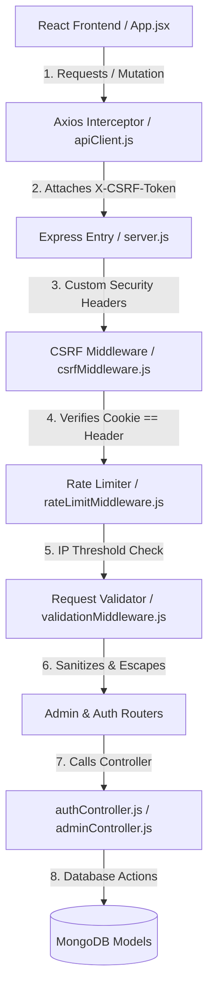

# Jonathan's Modules: Architecture, Security & Admin Core

This document details Jonathan's specific modules of the EduCore LMS application, their CommonJS architecture, and crucial security implementations.

This document explains what Jonathan's parts of the application do and how they function.

## 🔐 1. Authentication & Session Security

- **What it does**: Handles how users log in, register accounts, and log out securely.
- **Key Files**:
  - `authController.js` (Login/Registration/Session check logic using `jsonwebtoken` and `bcryptjs` — updated to support HOD profile lookups)
  - `authRoutes.js` (Auth routing URLs and rate limiter configuration)
  - `userRoutes.js` (User profile upload routing)
  - `authMiddleware.js` (JWT validation and role guards like `studentOnly` and HOD support checks)
  - `csrfMiddleware.js` (CSRF Cookie/Header verification)
  - `rateLimitMiddleware.js` (Auth endpoint request throttle)
- **How it works**:
  - When you log in, the server generates a token (JWT) and places it into an `httpOnly` secure cookie. The browser hides this token from JavaScript, making it safe from hackers trying to steal it (XSS protection).
  - **Active Session Validation**: Added an active session validation endpoint (`GET /api/auth/me`) so that the frontend can check if the user is still logged in without forcing a password entry.
  - **HOD Role Integration**: Updated the active session check and routing guards to recognize and lookup the new `head_of_department` role within the Instructor database collections.
  - **Role-Based Routing Security**: Added specific role authorization guards (like `studentOnly`) to restrict routing layers, ensuring cross-role routing exploits are fully blocked.
  - **CSRF Protection**: Integrated double-submit CSRF cookie checks to protect modifying backend requests. Exempted initial session-establishing routes (`/api/auth/login`, `/api/auth/register`, `/api/auth/logout`) so that authentication works smoothly even before a client-side CSRF cookie is initialized.
  - **Rate Limiting**: Added a local in-memory rate limiter on authentication endpoints to safeguard your server from automated brute-force attacks.

## 🛡️ 2. Input Sanitization & Security Validation

- **What it does**: Inspects incoming API parameters to verify their types and clean text inputs of malicious script tags.
- **Key Files**:
  - `validationMiddleware.js` (Express-validator input check schemas)
  - `server.js` (Registers custom security response headers)
- **How it works**:
  - **Input Validation**: Added automatic character escaping (`escape()`) to all register and user creation strings to prevent Cross-Site Scripting (XSS) script injections in the database.
  - **Security Headers**: Enforced custom HTTP security headers (`X-Frame-Options: DENY`, `X-Content-Type-Options: nosniff`, and custom Referrer Policies) to protect against Clickjacking and MIME-type sniffing.

## 🎨 3. Admin System Configuration & Common UI

- **What it does**: Allows the platform administrator to manage global site configurations, update SMTP settings for sending emails, and upload the school logo. Provides common UI states.
- **Key Files**:
  - `SystemSettingsPage.jsx` (Branding and settings form)
  - `adminController.js` (Saves settings and handles uploads)
  - `Skeleton.jsx` (Common UI loading states)
  - `ToastContext.jsx` (Centralized Toast notification manager)
  - `App.jsx` (Enables global Toast notifications wrapper)
  - `apiClient.js` (Automated CSRF request headers interceptor and path utility helper)
  - `Sidebar.jsx` (Sidebar navigation layout shared component with logout trigger and hover micro-animations)
- **How it works**:
  - The admin uploads a file which is processed by the backend and saved to a static directory. Configuration settings are saved directly to MongoDB.
  - **Skeleton Loaders**: Created a global shimmering `<Skeleton />` component to show professional content loading placeholders instead of generic text.
  - **Toast Notifications**: Setup a global `<ToastProvider>` React context and set up Axios request interceptors to automatically extract CSRF cookies and append them as headers on all state-changing API calls.
  - **Sidebar Upgrades**: Added a dedicated logout button at the bottom of the sidebar (utilizing the `useAuth` logout trigger), along with active-link styling shadows and icon-scaling hover micro-animations.

## 📈 4. Platform Analytics & Logs

- **What it does**: Shows system health metrics and keeps a running audit trail of system events.
- **Key Files**:
  - `AdminDashboard.jsx` (Stats cards and visual metrics)
  - `SystemLogsPage.jsx` (Audit logs viewer)
  - `AdminReportsPage.jsx` (Calculates enrollment trends and average grades)

## 🌍 5. Global Localizations & Theme Prefs (Arabic/English & Light/Dark Modes)

- **What it does**: Provides system-wide localization (switching layout direction between English LTR and Arabic RTL) and light/dark theme preference selections, with settings persisted in local storage.
- **Key Files**:
  - `SettingsContext.jsx` (Global settings provider, DOM class/direction injector, and translation lookups)
  - `translations.js` (Arabic/English localized strings dictionaries)
  - `index.css` (Overrode Tailwind v4 media dark queries to class-based mode)
  - `App.jsx` (Registers SettingsProvider layout context)
- **How it works**:
  - **Class-Based Theme Control**: When the user toggles the theme, the context applies the `.dark` class to the root `<html>` node. To support manual class-based toggling under Tailwind CSS v4, we registered a custom variant definition in the CSS entry point:
    ```css
    @custom-variant dark (&:where(.dark, .dark *));
    ```
    This directs the compiler to trigger `dark:` styles based on the presence of the class.
  - **RTL Direction Handling**: When Arabic is selected, the context injects `dir="rtl"` and `lang="ar"` on the document root element. Standard Flexbox/Grid elements automatically reverse layout orientations to accommodate Arabic writing rules.
  - **Dynamic Translators**: Components access the translation lookup function `t(key)` to dynamically print translated strings depending on the selected locale.

## 🔒 6. Dynamic SSL & HTTPS Enforcement

- **What it does**: Automatically generates local SSL certificates on the fly and boots both the frontend dev server and the backend Express REST API over secure HTTPS.
- **Key Files**:
  - `server.js` (Auto-generates certificates at startup if missing, initiates `https.createServer(sslOptions, app)`)
  - `generate-certs.js` (Independent, portable certificate script using pure JS/WebCrypto `selfsigned`)
  - `vite.config.js` (Vite server configurations to pull keys and boot on HTTPS)
  - `apiClient.js` (Updates fallbacks to use `https://localhost:5000` default)
- **How it works**:
  - **Auto-Bootstrapping Certificates**: When Node starts the backend, `server.js` checks if the `certs/` directory exists and whether `key.pem` and `cert.pem` are present. If missing, it imports and calls the generation function from `generate-certs.js` to asynchronously generate a new 2048-bit keypair and a self-signed Root CA certificate.
  - **Server SSL Booting**: Once the certificates are validated, Express is mounted to a standard Node `https` server instead of the raw `http` listener, serving all endpoints on HTTPS port `5000`.
  - **Client-Side SSL Integration**: Vite reads the generated certificate from the shared `backend/certs/` folder, enabling it to boot the local client server on `https://localhost:5173` with a graceful HTTP fallback if the keys are missing.
  - **Developer Browser Trust Requirement**: Since certificates are self-signed, developers must trust the certificates in the browser for both the frontend (`https://localhost:5173`) and the backend API (`https://localhost:5000`) to enable secure communication.

---

## 📚 7. Study & Viva Guide (Architecture & Admin Core)

This section acts as a study guide to help you master your specific modules and confidently navigate the project during your viva.

### 🗂️ A. How to Traverse Your Codebase Instantly

If the professor asks you about a specific feature, here is the traversal path you can explain:

1. **Frontend View**: Go to `frontend/src/pages/admin/` or `App.jsx` to trace active router URLs.
2. **API Client Request**: Look in the component for `apiClient.get(...)` or `apiClient.post(...)` to find the exact endpoint URL (e.g., `/api/auth/me` or `/api/admin/settings`).
3. **Backend Route**: Open `backend/routes/` and find the matching file (e.g., `authRoutes.js` or `adminRoutes.js`) to see which controllers handle it.
4. **Backend Controller**: Open `backend/controllers/` and read the controller function (e.g., `loginUser` or `updateSystemSettings`).
5. **Database Model**: Check `backend/models/` for the Mongoose schema (e.g., `Admin.js`, `SystemSetting.js`) to explain how the fields are structured in MongoDB.

### 🗺️ B. Detailed Feature Maps (Your Part vs. Other Parts)

Use the table below to quickly verify if an item is under **your ownership**. If the professor asks you about any topic in the "Not Your Part" column, state: **"This part was implemented by my colleague; they can explain their files and architecture."**

| System Domain                | 🔐 YOUR Part (Jonathan)                                                                                                                                                                                                                                                   | ❌ NOT Your Part (Colleagues)                                                    |
| ---------------------------- | ------------------------------------------------------------------------------------------------------------------------------------------------------------------------------------------------------------------------------------------------------------------------- | -------------------------------------------------------------------------------- |
| **Authentication**           | JWT creation, Secure HTTPOnly cookie setup, Session validations (`GET /api/auth/me` — supports HOD validation checks).                                                                                                                                                    | Student/Instructor model routing logic (handled by Yassin).                      |
| **Security Middlewares**     | CSRF Double-Submit token check (`csrfMiddleware.js`), Auth rate limiters (`rateLimitMiddleware.js`), and Role verification guards like `studentOnly` and `head_of_department` checks in (`authMiddleware.js`). | General token decryption wrapper (`authMiddleware.js` - shared).                 |
| **Input Sanitization**       | `express-validator` setup inside validation middleware (`validationMiddleware.js`), String escaping.                                                                                | Routing validations for courses/materials (handled by course owners).            |
| **Admin Configurations**     | Global system configuration (`SystemSettingsPage`), SMTP email template editors, file uploading logic.                                                                                                                                                                    | Roster management / User creation panel (handled by Yassin).                     |
| **Common UI Elements**       | Global `<ToastProvider />` and central alert contexts, `<Skeleton />` loaders, and Sidebar layout upgrades (logout trigger integration and active link shadowing / scaling animations).                                                                                   | Custom page styles, dashboard views for students (Magdy) & instructors (Seliem). |
| **Analytics & System Audit** | Platform statistics overview (`AdminDashboard.jsx`), audit log database logs (`SystemLogsPage.jsx`).                                                                                                                                                                      | Roster lists, course lists, discussion boards, message forms (Basel).            |
| **Localizations & Themes**   | Global multi-language (English/Arabic) dictionary, layout direction toggler (RTL/LTR), and Light/Dark mode transitions (utilizing Tailwind v4 class-based variants and localStorage persistence). | Custom profile fields or bio validations (handled by respective roles). |

### 🔄 C. Step-by-Step Data Flow

Here is how data flows through your key features:

#### Example 1: User Logging In (Auth Flow)

1. **Frontend Action**: The user enters their email and password on `/login` (`LoginPage.jsx`) and submits the form.
2. **Security Check (Rate Limiting)**: The request hits the backend at `POST /api/auth/login`. It passes through `rateLimitMiddleware.js`. If the IP has made >100 requests in 15 mins, it gets blocked with HTTP 429.
3. **Input Validation**: The request passes through `validationMiddleware.js`. `express-validator` verifies that the email is formatted correctly and the password meets standard length criteria.
4. **Controller Logic**: `authController.js` hashes the password using `bcryptjs` and compares it to the hashed password in MongoDB (`Admin`, `Instructor`, or `Student` model).
5. **Token Generation**: If valid, the server signs a JWT with the user's ID and role using `jsonwebtoken` and places it in an HTTPOnly, SameSite cookie named `jwt`.
6. **CSRF Setup**: The server also sets a `csrf-token` cookie so subsequent modifying requests are authorized.
7. **Frontend Response**: The server sends back user profile data (name, email, role), and the frontend router redirects them to their respective dashboard based on the role.

#### Example 2: Saving Admin Settings (Config Flow)

1. **Frontend Action**: Admin changes the school name or SMTP server settings and uploads a branding logo on `SystemSettingsPage.jsx`.
2. **File Processing**: The uploaded file is appended to a `FormData` object and sent as `POST /api/admin/settings`.
3. **CSRF Validation**: Express catches the request. Since it is a mutating `POST` request, `csrfMiddleware.js` intercepts it. It compares the cookie `csrf-token` with the request header `X-CSRF-Token`. If they match, the request proceeds; otherwise, it returns a 403 Forbidden error.
4. **Backend Upload**: `multer` middleware processes the file upload and saves the image to `backend/uploads/`.
5. **Database Storage**: The controller `adminController.js` saves the configuration to the `SystemSetting` MongoDB collection.
6. **Toast Alert**: Upon success, the backend returns the updated configuration. The frontend uses `showToast("Settings updated successfully", "success")` from the global `ToastContext.jsx` to render a transition-based popup.

### 🗄️ D. Database Structure & Important/Tough Spots

- **Schema Decoupling**: We use separate collections for `Admin`, `Instructor`, and `Student`. This keeps data cleaner since each user role has distinct metadata (e.g., student GPA, instructor departments).
- **Double-Submit Cookie CSRF Mechanism**: Traditional cookie auth is vulnerable to CSRF attacks (where a malicious site triggers requests on behalf of a logged-in user). To solve this, we generate a random CSRF token on the backend, store it in a non-httpOnly cookie, and require the frontend Axios client to read that cookie and manually inject the `X-CSRF-Token` header. The backend validates both values. Since malicious external scripts cannot read cookies due to SameSite policies, they cannot forge the matching header!
- **Cascading Transactions (Rollback Safety)**: To protect data integrity, when user deactivations are triggered inside `userManagementController.js`, the code runs rollback actions if child updates fail. For instance, when deactivating a Student, it soft-deactivates the user document and updates all of their active Enrollments to `inactive`. If the enrollment update fails, it rolls back the student's status back to active to prevent half-written states.

### 🎙️ E. Top 7 Questions Your Professor Might Ask

1. **"Why did you use HTTPOnly cookies for the JWT instead of storing it in localStorage?"**
   - _Answer_: Storing JWTs in `localStorage` makes them accessible to JavaScript. If our site gets infected with an XSS (Cross-Site Scripting) script, a hacker can read the storage and hijack the session. HTTPOnly cookies are hidden from JavaScript, preventing theft.
2. **"How does your rate-limiting middleware work?"**
   - _Answer_: It keeps track of request timestamps sent by each IP address inside an in-memory `Map`. If an IP exceeds 100 requests within 15 minutes on authentication endpoints, it triggers an HTTP 429 Error, protecting us from brute-force password guessing scripts.
3. **"What is the Double-Submit Cookie pattern, and how did you configure it?"**
   - _Answer_: We set a random token in a `csrf-token` cookie. Safe requests (GET/OPTIONS) ignore this check. Mutating requests (POST/PUT/DELETE) must send the token in the `X-CSRF-Token` request header. The middleware `csrfMiddleware.js` validates that both values match.
4. **"How does the global Toast Notification system work?"**
   - _Answer_: It is built using React Context API (`ToastContext.jsx`). The `ToastProvider` is wrapped around the root route in `App.jsx`. Any nested child page can call the hook `const { showToast } = useToast()` to stack active transition notifications without triggering page re-renders.
5. **"What happens if an admin uploads a new university logo?"**
   - _Answer_: The request is handled by `multer` middleware on `backend/routes/adminRoutes.js`. It parses the multipart form data, stores the file in `backend/uploads/` with a timestamped unique name, and updates the logo file URL in the `SystemSetting` MongoDB collection.
6. **"How did you implement class-based dark mode under Tailwind CSS v4, and how is RTL direction applied for Arabic support?"**
   - _Answer_: In Tailwind v4, JS configurations like `darkMode: 'class'` are no longer supported. To enable class-based dark mode, we defined a custom CSS variant selector `@custom-variant dark (&:where(.dark, .dark *));` in our `index.css` file. For Arabic support, our custom `SettingsContext` dynamically sets `document.documentElement.dir = 'rtl'` and `document.documentElement.lang = 'ar'` when the user chooses Arabic. This automatically flips the flex/grid layout orientations in the browser.
7. **"How does the local HTTPS configuration work, and why did you implement it?"**
   - _Answer_: To secure data transport in local development (supporting the HTTPS bonus), we configure both frontend and backend to run on HTTPS. The backend checks for keys under `certs/` and uses the pure JS `selfsigned` library to auto-generate them asynchronously on startup if missing. Express starts on HTTPS port 5000 using Node's `https` module. Vite reads these certificates to start on `https://localhost:5173`. Developers must trust the certificate for both ports in their browser so Axios calls aren't blocked.

---

## 📁 Complete File Inventory

The following files are owned/authored by Jonathan:

- **Backend Controllers & Routes** (Structured using CommonJS `require` imports and `module.exports`):
  - `authController.js`
  - `adminController.js`
  - `authRoutes.js`
  - `adminRoutes.js`
  - `userRoutes.js`
- **Backend Middleware**:
  - `authMiddleware.js` (Shared access check, plus `studentOnly` and HOD guards)
  - `csrfMiddleware.js`
  - `rateLimitMiddleware.js`
  - `validationMiddleware.js`
  - `uploadMiddleware.js` (Shared file upload configurations, including assignment files and Seliem's material upload configuration)
- **Backend Models**:
  - `Admin.js`
  - `SystemLog.js`
  - `SystemSetting.js`
  - `EmailTemplate.js`
- **Frontend Pages & Contexts** (Vite JSX/JS compiled files using ES Modules standard for client-side bundle efficiency):
  - `ToastContext.jsx`
  - `SettingsContext.jsx` (Global settings provider, DOM class/direction selector, and translations hook helper)
  - `translations.js` (Arabic/English localized strings dictionaries)
  - `apiClient.js`
  - `AdminDashboard.jsx`
  - `SystemLogsPage.jsx`
  - `SystemSettingsPage.jsx`
  - `EmailTemplatesPage.jsx`
  - `AdminReportsPage.jsx`
  - `CourseManagementPage.jsx`
  - `Skeleton.jsx`
- **SSL Certificates & Configuration**:
  - `generate-certs.js`
  - `vite.config.js`
- **Core Server Config**:
  - `server.js` (Shared security configurations and middleware registrations)

---

# 🗺️ SECTION 1 — My Code: Big Picture Overview

In the lifecycle of a modern web application, security and administration form the foundational bedrock. My code represents the structural architecture and core administrative machinery of the EduCore LMS. Without this part, the application would have no session security, no defenses against malicious automation, no request validation, and the system administrator would have no way to brand or configure the application.

## What Problem My Code Solves

1. **Access Controls & Sessions**: Prevents anonymous users from reading or writing data. It sets up session cookies that the browser hides from scripts, blocking session hijacking.
2. **Defensive Shielding**: Exposes rate-limiting rules to choke brute-force automated login bots, validates all parameters entering our Node/Express environment, and prevents Cross-Site Request Forgery (CSRF) exploits.
3. **Admin Controls**: Provides the administrative backend to edit SMTP mail routes, manage courses, render platform system health logs, compile database storage capacity data, and upload the university logo.
4. **UX Cohesion**: Supplies a central toaster system to broadcast user updates across asynchronous pages and sets up loading skeleton assets.

## How My Frontend and Backend Connect

The communication loop is built on top of `apiClient.js` (the Axios setup) and Express routes:

- **Authentication**: The login form submits credentials via `apiClient.post('/api/auth/login')`. The backend validates the inputs, hashes the password, and replies with user metadata, setting the secure `jwt` session cookie and `csrf-token` cookie in the browser.
- **State Updates**: The client uses `apiClient` for all CRUD tasks. For example, `SystemSettingsPage.jsx` makes a `PUT /api/admin/settings` call. Since this changes server state, the Axios interceptor reads the `csrf-token` cookie and appends it as the `X-CSRF-Token` header. The Express server matches these cookies/headers before running the controller.
- **Branding Pipeline**: The admin uploads a branding image. This sends a multipart form to `POST /api/admin/upload/logo`. The backend saves the image files using `multer` to `/uploads`, returns the image url path, and updates the `SystemSetting` DB collection.

## How My Code Interacts with Colleagues' Parts

My modules provide the platform framework that my colleagues depend on:

1. **Yassin's User Management & Course Roster**: When Yassin's panel creates or deactivates students or instructors, the request flows through my validation rules and utilizes the database schemas.
2. **Basel's Messaging & Notifications**: Basel's real-time messaging page uses my `ToastContext` hook to alert users when a message is successfully delivered, read, or deleted. His APIs also run behind my HTTPOnly verification wrapper.
3. **Seliem's & Magdy's Portals**: When Seliem posts a new course or Magdy registers, they make requests that are protected by my rate-limiting middleware, CSRF validations, and token verifications.

## Architecture and Data-Flow Diagram



---

# 🔍 SECTION 2 — Deep Code Explanation

Here is the file-by-file breakdown of my parts of the codebase, explaining their purpose, internal logic, design patterns, and important sections to memorize.

## 🛠️ 1. Backend Middleware & Config Files

### 📄 `backend/middleware/csrfMiddleware.js`

- **Purpose**: Generates random CSRF tokens for clients and verifies matching token headers for state-changing requests.
- **Plain English Logic**:
  - `setCsrfCookie`: Checks if a incoming browser request contains a cookie named `csrf-token`. If not, it uses Node's native `crypto` module to generate a random 32-byte hexadecimal string and writes it to a non-HTTPOnly cookie called `csrf-token` (which the frontend code can read).
  - `verifyCsrf`: Examines the request method. If it is a safe method (`GET`, `HEAD`, `OPTIONS`), it bypasses validation. It also bypasses checks for authentication routes (`/api/auth/login`, `/api/auth/register`, `/api/auth/logout`) since those establish the user session. For other unsafe methods (`POST`, `PUT`, `DELETE`), it compares the `csrf-token` cookie with the `x-csrf-token` request header. If they don't match, it returns a `403 Forbidden` response.
- **Design Patterns & Tricky Parts**:
  - The `csrf-token` cookie has `httpOnly: false` so that the client-side JavaScript interceptor can read the token. The `jwt` cookie remains `httpOnly: true`. This separation is a crucial security pattern.

### 📄 `backend/middleware/rateLimitMiddleware.js`

- **Purpose**: Safeguards authentication endpoints from brute-force password attacks by throttling requests.
- **Plain English Logic**:
  - Maintains an in-memory `Map` (`ipRequestCounts`) tracking the active request timestamps for caller IP addresses.
  - When a request arrives, it checks if the IP is already logged. If it is, it filters out timestamps older than the specified window. If the IP request count exceeds the threshold `maxRequests`, it rejects the request with an HTTP `429 Too Many Requests` error. Otherwise, it pushes the current timestamp and proceeds.
  - **Where the limits are set**: The middleware itself is generic and accepts parameter configurations. The specific limit of **100 requests per 15 minutes** is configured and passed to the middleware during instantiation inside `backend/routes/authRoutes.js`, where `windowMs` is set to `15 * 60 * 1000` (15 minutes) and `maxRequests` is set to `100`.
- **Complex / Viva-Critical Flag**:
  - Memory Leak Risk: In production, using a local memory map `ipRequestCounts` can lead to memory exhaustion under distributed attacks. In a production system, this should be replaced with a distributed cache like Redis. Be ready to explain this to the professor.

### 📄 `backend/middleware/validationMiddleware.js`

- **Purpose**: Verifies that input payloads conform to exact format specifications and sanitizes string fields.
- **Plain English Logic**:
  - Uses `express-validator` rules. For registrations, it verifies the email format, ensures the password is at least 6 characters, and uses `.trim().escape()` to strip out HTML tags or script injection strings.
  - If validation checks fail, `validateRequest` intercepts the flow and immediately returns an HTTP `400 Bad Request` containing an array of validation error messages.

### 📄 `backend/server.js` (Security Portions)

- **Purpose**: Serves as the global server entry point, registering middlewares and custom security response headers.
- **Plain English Logic**:
  - Injects global security headers via standard `app.use()` calls:
    - `X-Frame-Options: DENY`: Prevents Clickjacking attacks (stops the site from being rendered inside an iframe on external sites).
    - `X-Content-Type-Options: nosniff`: Prevents MIME-type sniffing exploits.
    - `X-XSS-Protection: 1; mode=block`: Activates built-in browser scripting filters.
    - `Referrer-Policy: strict-origin-when-cross-origin`: Controls how much referrer metadata is sent in requests.
  - Disables the `X-Powered-By` header so automated scripts cannot identify that the server runs Express.

---

## 🗄️ 2. Backend Controllers & Models

### 📄 `backend/controllers/authController.js`

- **Purpose**: Manages user login, registration, logout, and active session checking.
- **Key Functions**:
  - `registerUser`: Decides which user model to query based on `role` (Admin, Instructor, Student), checks for duplicates, hashes the password using `bcryptjs`, saves the record, generates a JWT, and sets it in the cookie.
  - `loginUser`: Locates the user by email, compares the password with `bcrypt.compare()`, generates a JWT, sets the cookie, and returns the basic user profile object.
  - `checkSession` (`GET /api/auth/me`): Verifies the logged-in user by decoding the JWT from their cookies, returning active profile data.
- **Design Patterns**:
  - Token Placement: Uses a helper function `setCookieToken` to write the JWT directly into an `httpOnly` cookie. This makes it impossible for client-side scripts to steal the token.

### 📄 `backend/controllers/adminController.js`

- **Purpose**: Provides administrative CRUD utilities, compiles log histories, generates report statistics, and manages settings.
- **Key Functions**:
  - `getSystemLogs`: Returns a paginated list of logs sorted by date.
  - `getPlatformAnalytics`: Aggregates the counts of database documents to show total students, instructors, and courses.
  - `getAdminReports`: Aggregates enrollment status ratios and calculates average grades by converting letter grades to points.
  - `uploadLogoFile`: Processes logo images uploaded via `multer` and saves the file URL to settings.

### 📄 `backend/models/SystemSetting.js`, `Admin.js`, `SystemLog.js`, `EmailTemplate.js`

- **Purpose**: These Mongoose schemas structure administrative data:
  - `SystemSetting`: Stores platform configurations (SMTP settings, branding logo URL).
  - `SystemLog`: Stores informational, warning, or error logs for audit trails.
  - `EmailTemplate`: Stores subject lines and body HTML markup for system notifications.
  - `Admin`: Structures system administrator credentials and permissions.
    * **Pre-Save Middleware (`adminSchema.pre('save')`)**: Before an Admin document is saved to MongoDB (both on creation and modification), this pre-save hook runs automatically to perform two secure processes:
      1. **Initials Generation**: If no initials are provided, it splits `full_name` by spaces, extracts the first letter of each word, joins them, converts them to uppercase, and slices the output to a maximum of 2 characters (e.g., `"John Doe"` becomes `"JD"`).
      2. **Automatic Bcrypt Hashing**: It checks if the password field has been modified using `this.isModified('password')`. If the password hasn't changed (such as when updating an email), it skips hashing to prevent locking the user out. Otherwise, it hashes the plain-text password with `bcrypt.genSalt(10)` and secures it before writing to MongoDB.

---

## 🎨 3. Frontend Contexts, Pages, & UI Utilities

### 📄 `frontend/src/lib/apiClient.js`

- **Purpose**: Sets up a pre-configured Axios instance to communicate with the backend, automatically sending credentials and attaching CSRF tokens.
- **What Axios is & What it does**: Axios is a promise-based HTTP client library that makes asynchronous REST API calls (GET, POST, PUT, DELETE) from the React application to the Express backend. It handles JSON serialization/deserialization automatically and supports global interceptors to preprocess requests.
- **Plain English Logic**:
  - **`withCredentials: true` Configuration**: This option is passed to `axios.create()`. It is crucial because the frontend (`port 5173`) and backend (`port 5000`) run on different ports (cross-origin). By default, browsers strip cookies on cross-origin requests. Setting `withCredentials: true` instructs the browser to automatically include the secure `httpOnly` JWT session cookie on every outgoing API request and allows setting it on response.
  - **CSRF Request Interceptor**: Automatically parses the browser's cookies for a `csrf-token` value and injects it as an `X-CSRF-Token` header on mutating write requests (`POST`, `PUT`, `DELETE`).

### 📄 `frontend/src/context/ToastContext.jsx`

- **Purpose**: Manages global toast alerts across the application.
- **Plain English Logic**:
  - **Context Creation & Hook**: Creates `ToastContext` and exposes the `useToast` custom hook which checks if it's being used within the `ToastProvider` context, throwing an error if accessed outside it.
  - **State Management**: The `ToastProvider` keeps an array of active toasts in a state variable (`toasts`).
  - **Adding Toasts**: The `showToast` function is memoized via `useCallback` to prevent unnecessary renders. It generates a unique ID using `Date.now()` combined with a base-36 random string and appends the new toast object to the state with its message and type (defaults to `'success'`).
  - **Removing Toasts**: The `removeToast` function is also memoized and filters out the dismissed toast by its ID.
  - **Global Stacked Container**: Renders a fixed container at the bottom-right of the screen (`fixed bottom-8 right-8 z-[200]`). It uses `pointer-events-none` so mouse clicks can pass through the layout to underlying pages, but the individual toast items use `pointer-events-auto` so users can interact with them or click the close buttons.
  - **Self-Dismissal & Cleanup**: The `ToastItem` component triggers a 3.5-second (3500ms) auto-dismiss timeout inside a `useEffect` hook. If a toast is manually closed or unmounted early, it clears the timeout (`clearTimeout`) to avoid memory leaks.
  - **Dynamic Styling & Icons**: Combines baseline glassmorphism/fade-in animation classes using `twMerge` with type-specific styling:
    - **Success**: Emerald green background (`bg-emerald-500/90 border-emerald-400/30`) with a `check_circle` icon.
    - **Error**: Rose red background (`bg-rose-500/90 border-rose-400/30`) with an `error` icon.
    - Includes a manual dismiss button utilizing a `close` Material Symbols icon.

### 📄 `frontend/src/components/ui/Skeleton.jsx`

- **Purpose**: Provides a reusable shimmering loading screen element.
- **Plain English Logic**:
  - Renders a blank CSS-based layout utilizing an animation class (`animate-pulse`) to show a pulsing grey template block while actual content is being fetched.

### 📄 `frontend/src/pages/admin/SystemSettingsPage.jsx`

- **Purpose**: Renders the form for administrators to edit global configurations, SMTP credentials, and upload a custom logo.
- **Plain English Logic**:
  - Fetches current settings on mount. When the form is submitted, it validates inputs, constructs request payloads, and uses `apiClient.put` to update the settings.
  - For logo uploads, it handles the file select event, builds a `FormData` payload, and posts to the file upload route.

---

# 📚 SECTION 3 — Study Guide: Master My Part

## 🔑 Key Concepts & Technologies Explained

1. **JSON Web Token (JWT) Session Security**
   - _What it is_: A compact, URL-safe method of representing user identities.
   - _Why we use it_: Traditional server-side sessions require storing active sessions in the database, which gets slow as users scale. JWTs are signed cryptographically, meaning the server can decode the token to verify the user without querying the database for session records.
2. **HTTPOnly & SameSite Cookie Protection**
   - _What it is_: Cookie parameters that prevent scripts from reading them (`httpOnly`) and prevent them from being sent with cross-site requests (`sameSite: 'strict'`).
   - _Why we use it_: If we save the token in `localStorage`, malicious scripts can steal it (an XSS attack). By using `httpOnly` cookies, the browser hides the token from JavaScript. `sameSite: 'strict'` blocks CSRF by ensuring the cookie is only sent on requests originating from our domain.
3. **Double-Submit Cookie CSRF Defense**
   - _What it is_: Storing a CSRF token in a non-httpOnly cookie and requiring the client to read it and send it in a custom header.
   - _Why we use it_: Since cookies are automatically sent with requests, a malicious site could trick a user's browser into sending a request to our backend. Since malicious sites cannot read our cookies due to browser security restrictions, they cannot send the matching header. The server rejects any state-changing request that doesn't have matching cookie and header tokens.
4. **RESTful APIs & Centralized Axios Client Integration**
   - _What it is_: Communicating over standard HTTP methods (GET, POST, PUT, DELETE) representing stateless resources, coupled with a central Axios client (`apiClient.js`) that wraps requests, manages cookies, and configures headers globally.
   - _Why we use it_: It decouples the React frontend from the Express backend, allowing clean, modular APIs. By centralizing the Axios instance, we can configure global request/response behaviors (like automatically injecting CSRF headers via interceptors, setting the base URL, and setting `withCredentials: true` so HTTPOnly JWT session cookies are handled securely without boilerplate code in every component).
5. **Asynchronous JavaScript (Async/Await & Promises)**
   - _What it is_: JavaScript's programming pattern to declare non-blocking, asynchronous handlers (using `async` functions and the `await` keyword) that manage delayed execution states (Promises).
   - _Why we use it_: Database calls like MongoDB queries (`findOne`, `create`, `save`) are delayed network operations. By using `async`/`await`, we stop this specific controller route execution thread while waiting for the database, without blocking or freezing the single-threaded Node.js event loop. This allows the backend to remain highly responsive and serve multiple concurrent users.

---

## 📖 Glossary of Terms

- **Middleware**: Functions in Express that run after a request is received and before the route controller executes.
- **Interceptors**: Functions in Axios that intercept and modify outgoing requests (e.g. attaching CSRF headers) or incoming responses.
- **Salt Rounds**: The hashing complexity setting for `bcrypt`. We use 10 rounds, which balances password security with server processing speed.
- **Multer**: A Node middleware for parsing `multipart/form-data` requests, primarily used for file uploads.
- **Pulse Animation**: A CSS transition effect (`animate-pulse`) that creates a shimmering loading skeleton.
- **Dotenv**: A utility module that loads environment variables from a local `.env` file into Node's global `process.env` namespace at runtime, separating configuration secrets from logic.

---

## 🔄 Core Flow Walkthroughs

### Flow 1: User Authentication & Cookie Generation

```
[Client (LoginPage.jsx)] ---> POST /api/auth/login ---> [Rate Limiter (rateLimitMiddleware.js)]
                                                                    |
                                                           [Input Sanitization]
                                                                    |
                                                           [Controller Login]
                                                                    |
  [Client (Dashboard)]  <--- Responds 200 & JWT Cookie <--- [Generates JWT Token]
```

1. **Request**: The user enters their email and password.
2. **Rate Limit**: The middleware checks the IP request count.
3. **Validation**: Sanitizes inputs and validates formatting.
4. **Bcrypt check**: The controller searches MongoDB for the user email, grabs the hashed password, and runs `bcrypt.compare()`.
5. **Cookie set**: The server signs a JWT and writes it to an `httpOnly` secure cookie. It also generates a CSRF token and sets it in a `csrf-token` cookie.
6. **Redirect**: The client receives user metadata and redirects them to their dashboard.

### Flow 2: Double-Submit CSRF Validation Check

```
[Client apiClient.js] ---> Reads 'csrf-token' Cookie ---> Injects 'X-CSRF-Token' Header
                                                                       |
[Client Axios Request] ---------------------------------------------> [Express Server]
                                                                       |
[Access Allowed]      <--- Cookie matches Header <--- [csrfMiddleware verifyCsrf]
```

1. **Client Interceptor**: Axios catches an outgoing state-changing request.
2. **Token Extraction**: Reads the value of the `csrf-token` cookie.
3. **Header Injection**: Appends the value to the request headers under `X-CSRF-Token`.
4. **Backend Catch**: `csrfMiddleware.verifyCsrf` intercepts the request.
5. **Comparison**: Compares `req.cookies['csrf-token']` with `req.headers['x-csrf-token']`.
6. **Result**: If they match, `next()` is called. If not, the request is rejected with a `403 Forbidden` error.

---

## 💡 Gotchas & Edge Cases to Know

- **File Size Limits on Logo Uploads**: Multer is configured to handle files up to 2MB. If a user uploads a larger file, it will throw a server error.
- **Token Expiration (Expired JWT)**: The JWT is configured to expire in 24 hours. If a user leaves their tab open, subsequent API calls will fail with a `401 Unauthorized` error.
- **In-Memory Rate Limiter Reset**: The rate limiter is stored in application memory. When the backend server restarts, the rate limit caches are reset, clearing any blocked IP addresses.

---

## ❓ Study Questions & Answers

1. **"What is the difference between httpOnly cookies and local storage?"**
   - _Answer_: `localStorage` can be read by JavaScript scripts, leaving it vulnerable to XSS exploits. `httpOnly` cookies are inaccessible to JavaScript, protecting tokens from being read by malicious scripts.
2. **"Why do safe HTTP methods bypass CSRF checks?"**
   - _Answer_: Safe methods like `GET` and `HEAD` do not modify server state. Since they only read data, they do not require CSRF token validation.
3. **"How does express-validator protect the database from script injection?"**
   - _Answer_: It sanitizes inputs using `escape()`, which converts characters like `<` and `>` into HTML entities (e.g. `&lt;` and `&gt;`), rendering any injected script tags harmless.

---

# 🎤 SECTION 4 — Presentation & Demo Prep

## 60-Second Elevator Pitch

> "I built the security and administration core of the EduCore LMS. I set up secure HTTPOnly session cookie storage, configured Double-Submit Cookie CSRF defenses, and built rate-limiting rules to safeguard our endpoints from brute-force attacks. On the frontend, I developed the global toast alert context, shimmering loading skeleton elements, and the administrative dashboard. This provides our administrators with complete control over global configurations, SMTP mail settings, and branding options, establishing a secure and cohesive foundation for the platform."

---

## 🖥️ Step-by-Step Demo Script

```
[Login Screen] ---> [Admin Dashboard] ---> [System Settings] ---> [Log Files]
       |                    |                    |                   |
Show Rate Limiting   Show Stats Cards     Upload Logo Asset   Show Log Audit Trails
```

1. **Step 1: Session Security Showcase**
   - _Action_: Open the browser developer tools, go to the Application tab, and select Cookies.
   - _Talking Points_: _"Notice that when I log in, the server sets a secure `jwt` session cookie. It is flagged as HTTPOnly, meaning client-side scripts cannot read or exploit it."_
2. **Step 2: Admin settings and logo upload**
   - _Action_: Navigate to `/admin/settings` and upload a new platform logo.
   - _Talking Points_: _"Our administration settings let you brand the platform and configure SMTP settings. When I upload a logo, a multipart request is sent to the backend, validated, saved via Multer, and the new URL is saved to the database. The frontend updates dynamically."_
3. **Step 3: Audit trail logging**
   - _Action_: Navigate to the system logs page.
   - _Talking Points_: _"Every configuration change, registration, or logout triggers an audit log. The logs are paginated and sorted by date, providing admins with a complete system audit trail."_

---

## 🎙️ Viva Questions & Answers

### Question 1: "If the JWT cookie is protected by SameSite=Strict, why do we need CSRF tokens?"

- **Answer**: While `SameSite=Strict` offers strong protection, older browsers do not fully support it. CSRF tokens provide a second layer of defense, securing the application across different browser environments.

### Question 2: "What is your file upload strategy, and is it secure?"

- **Answer**: We use `multer` to handle logo uploads. We restrict uploads to image formats (PNG, JPG) and enforce a file size limit of 2MB. Files are renamed using unique timestamps to prevent name collisions on the server.

### Question 3: "How does the Axios client handle CSRF tokens on page load?"

- **Answer**: The Axios interceptor parses `document.cookie` for the `csrf-token` key. If found, it automatically attaches it as the `X-CSRF-Token` header on all outgoing state-changing requests, making security handling transparent to the user.

### Question 4: "Why does the application follow the MVC pattern without having a 'views' folder on the backend?"

- **Answer**: The project uses a **decoupled (or headless) MVC architecture**. The **Model** (Mongoose schemas) and **Controller** (Express routes and controllers) reside on the backend, while the **View** is completely offloaded to the frontend client as a React Single Page Application (SPA). Instead of the backend rendering templates (like EJS or Pug) and serving static HTML pages, it exposes a stateless REST API that sends structured JSON data. The React frontend consumes this data and dynamically renders the views in the client's browser, providing a modern, responsive user experience and a clean separation of concerns.

---

## 📈 Technical Details to Highlight

1. **Separation of Cookie Security Policies**: Highlight that session tokens are kept in secure `httpOnly` cookies, while CSRF tokens are stored in accessible cookies so they can be sent as headers.
2. **Rate Limiting Thresholds**: Emphasize that the rate-limiting middleware is registered only on authentication routes, protecting the server from automated brute-force attacks.
3. **Regex aggregation for Analytics**: Point out how the reporting endpoints dynamically calculate average GPA and enrollment rates using Mongoose aggregation pipelines.

---

# ⚙️ Technical Choices

This section documents key architectural choices made during development to justify our core implementation stack.

### 1. Process-Wide Access to Environment Variables (JWT Secret, etc.)

Even though security tokens (like `JWT_SECRET`) and configuration keys are only defined in the local `.env` file, they are easily read and referenced by every module inside the backend. This is made possible by the following mechanisms:

- **Centralized Initialization**: At the absolute entry point of the server (`backend/server.js`), the `dotenv` module (a zero-dependency package that reads configurations from a local `.env` file) is imported and configured immediately:
  ```javascript
  const dotenv = require("dotenv");
  dotenv.config();
  ```
- **Process Environment Binding**: The `dotenv.config()` method reads the raw text of the `.env` file, parses its key-value pairs, and dynamically binds them to Node's native `process.env` global object.
- **Node's Global Namespace**: The `process` object is a global variable provided by the Node.js runtime environment, meaning it is accessible to every script running in the active process. Because `dotenv.config()` executes before any other application modules are required, any nested module (e.g., controllers, database models, middlewares) can access these values directly using `process.env.JWT_SECRET` without needing to individually reload the `.env` configuration file.

### 2. Why We Cannot Use EJS With React as Our Frontend

We cannot combine EJS templates with React on the frontend because they represent two fundamentally conflicting UI architectures:

- **Server-Side Rendered Templates (EJS)**: EJS (Embedded JavaScript) compiles pages entirely on the Node.js backend. Every time a user navigates to a new page, the server receives the HTTP request, compiles the template with server data, builds a raw static HTML file, and sends it down to the browser.
- **Client-Side Single-Page Applications (React)**: React is a client-side component library that runs inside the user's browser. It serves a single shell HTML page and downloads a compiled JavaScript bundle. React dynamically updates the browser's Document Object Model (DOM) using a virtual representation (Virtual DOM) based on client-side state changes, rendering UI updates instantly without requiring server-side page reloads.
- **The Lifecycle Collision**: Combining EJS and React causes a direct collision. EJS expects to serve fully formed static HTML layouts directly from the server, while React expects to mount onto a blank root element and take complete ownership of the DOM tree. Injecting React code inside EJS templates breaks React's runtime reconciliation engine, client-side React Router navigation, and state hook synchronization.
- **Decoupled Architecture**: To harness the strengths of both technologies, we chose a fully decoupled design:
  - **Frontend**: A client-side React Single Page Application (SPA) built and compiled using Vite (configured with standard ES Modules syntax like `import`/`export`).
  - **Backend**: A headless, stateless JSON REST API built with Node/Express (configured using CommonJS module syntax like `require` and `module.exports`).
- **The Connection to CommonJS**: Since the frontend React SPA is completely separate, the backend server does not need to render HTML pages, eliminating template engines like EJS entirely. The Express server acts strictly as a raw JSON API. In this decoupled Node API setup, **CommonJS** (`require`/`module.exports`) was chosen for backend module management because:
  - It is natively supported by Node.js, requiring no transpilation, bundlers, or compilation steps (like Babel or TSC) to run on the server.
  - It handles module loading synchronously, which is ideal for server-side environments resolving databases, models, and routes on startup.
  - It offers a highly stable and mature module ecosystem for Express backend architectures.

---

# 📦 Dependencies and Running

This section provides a detailed guide on the dependencies required to run the EduCore LMS project, how they were installed, and the commands needed to launch the application.

### 1. Library Dependencies Installed

The application is split into two independent directory trees: the backend API (`backend/`) and the frontend React application (`frontend/`). Each environment has its own dependency manifest.

#### A. Backend Dependencies (Node/Express API)

These libraries support the server-side logic, routing, security middlewares, and database integrations:

- **`express`**: The core lightweight web application framework for routing and middleware management.
- **`mongoose`**: An Object Data Modeling (ODM) library for MongoDB, letting us define schemas, validate fields, and handle database relationships.
- **`dotenv`**: Loads environment variables from the `.env` configuration file into the global `process.env` object.
- **`cors`**: Enables Cross-Origin Resource Sharing, allowing our React frontend running on `http://localhost:5173` to safely request data from our Express server.
- **`cookie-parser`**: Parses Cookie headers and populates `req.cookies`, which is critical for reading the secure `jwt` and `csrf-token` session keys.
- **`bcryptjs`**: Cryptographically hashes user passwords with salt rounds before storing them in MongoDB, and handles safe password comparisons during login.
- **`jsonwebtoken`**: Generates and cryptographically signs authentication tokens (JWTs) representing active user sessions.
- **`express-validator`**: An input-sanitization and validation middleware suite used to validate email formats, check text length, and escape potential HTML script injection tags.
- **`multer`**: Parses `multipart/form-data` request bodies, used exclusively for validating and storing custom logo uploads.
- **`selfsigned`**: Generates local SSL certificates on the fly to support secure HTTPS server tests.
- **`nodemon`** _(Development Dependency)_: Automatically monitors backend source files and reboots the Node process whenever a code change is detected.

#### B. Frontend Dependencies (React SPA)

These packages support the client-side user interface, layout engine, and network client:

- **`react`** & **`react-dom`**: The UI rendering library and DOM manager for component life cycles.
- **`react-router-dom`**: Handles SPA client-side routing, route protections, and page path mapping.
- **`axios`**: The HTTP client used to request endpoints, configured with interceptors to automatically grab CSRF cookies and pass them as headers.
- **`lucide-react`**: An icon pack providing high-quality, lightweight visual indicators for dashboard menus and alerts.
- **`clsx`** & **`tailwind-merge`**: Utility helpers used to conditionally merge Tailwind CSS classes dynamically without class conflicts.
- **`tailwindcss`**, **`postcss`**, **`autoprefixer`**, **`@tailwindcss/postcss`** _(Development Dependencies)_: The styling engine that compiles and applies custom variables, flex grids, animations, and modern UI styles.
- **`vite`** & **`@vitejs/plugin-react`** _(Development Dependencies)_: The next-generation fast build tool and hot-module reloading local dev server.

---

### 2. Installation Commands Used

To install these modules from scratch, we ran the following terminal commands inside their respective directory folders:

#### Installing Backend Dependencies

Open your terminal, navigate to the `backend/` directory, and execute:

```bash
# Install production libraries
npm install express mongoose dotenv cors cookie-parser bcryptjs jsonwebtoken express-validator multer selfsigned

# Install development tool (Nodemon)
npm install --save-dev nodemon
```

_(Alternatively, if you already have the `package.json` file, running `npm install` inside the `backend/` folder resolves and installs all of these packages automatically.)_

#### Installing Frontend Dependencies

Open your terminal, navigate to the `frontend/` directory, and execute:

```bash
# Install production libraries
npm install axios react-router-dom lucide-react clsx tailwind-merge react react-dom

# Install CSS and build tooling
npm install --save-dev vite @vitejs/plugin-react tailwindcss postcss autoprefixer @tailwindcss/postcss
```

_(Similarly, if the `package.json` file is present, running `npm install` inside the `frontend/` folder automatically downloads and links these packages.)_

---

### 3. How to Start the Project (When Opening Your Laptop)

To launch both the frontend and backend servers concurrently when starting a development session, follow these steps:

#### Step 1: Start the Backend API

1. Open a new terminal window or tab.
2. Navigate to the backend directory:
   ```bash
   cd backend
   ```
3. Run the development script:
   ```bash
   npm run dev
   ```
   _Note: This starts the server on port `5000` (or `5443` for HTTPS if SSL certs are generated). It will dynamically reload when changes are made. Ensure your MongoDB service is running locally or your Atlas URI in the `.env` file is active._

#### Step 2: Seed the Database (Optional / First Run)

If you are running the project for the first time and need to populate local collections with default users (Admin, Instructors, Students) and configuration presets:

1. Keep the backend terminal open, or open a new terminal inside the `backend/` directory.
2. Run the seed script:
   ```bash
   npm run seed
   ```

#### Step 3: Start the Frontend React App

1. Open a separate terminal window or tab (so the backend server continues to run).
2. Navigate to the frontend directory:
   ```bash
   cd frontend
   ```
3. Run the frontend Vite dev server:
   ```bash
   npm run dev
   ```
4. Once running, open your browser and navigate to the address shown in the output (typically `http://localhost:5173`).

---

## 🤝 Shared Parts & App.jsx Mapping

This section outlines which portions of the frontend routing configuration (`App.jsx`) belong to Jonathan, and details the shared files that link Jonathan's infrastructure with the rest of the team's modules.

### 🗺️ Jonathan's Parts in App.jsx

Inside `App.jsx`, Jonathan is responsible for the overall app wrapper, session contexts, and administrative routes:
1. **Global Context Providers**:
   - `<AuthProvider>`: Manages the logged-in session state and makes the active user object accessible throughout the app.
   - `<ToastProvider>`: Enables the application-wide popup alert container.
2. **Access Control (Protected Routing)**:
   - `<ProtectedRoute>`: The security wrapper that intercepts routes and blocks access if the user's role does not match the page permissions.
3. **Public & Auth Routes**:
   - `/login` (renders `LoginPage`): The portal authentication form.
   - `/register` (renders `RegisterPage`): The user registration form.
4. **Admin Route Group (🔐 Jonathan's Owner Area)**:
   - `/admin` (renders `AdminDashboard`): Platform metrics and growth tracking.
   - `/admin/users` (renders `UserManagementPage`): Governance dashboard.
   - `/admin/logs` (renders `SystemLogsPage`): System logs audit viewer.
   - `/admin/settings` (renders `SystemSettingsPage`): Branding and SMTP configs.
   - `/admin/templates` (renders `EmailTemplatesPage`): System notification editor.
   - `/admin/reports` (renders `AdminReportsPage`): Data aggregation trends.
   - `/admin/courses` (renders `CourseManagementPage`): Global courses directory.

### 🔗 Shared Parts

These files are shared code infrastructure owned by Jonathan but utilized by the entire team:
- **`server.js`**: The main entry point of the Express API. It registers shared security headers and mounts route prefixes for Seliem's courses, Basel's messages, Magdy's student views, and Yassin's roster endpoints. Note that HOD routes (`/api/instructor/department`) are registered before standard instructor routes to preserve Express route matching precedence.
- **`App.jsx`**: The central React Router file. Used by everyone to map their page URLs to React components. Includes routing configuration for the HOD portal (`/department-head`).
- **`apiClient.js`**: The Axios wrapper. Used by all frontend pages to talk to the backend, automatically appending JWT cookies and CSRF headers. Expanded to include the `getFileUrl` helper path formatting export.
- **`authMiddleware.js`**: Used by all backend routers to decode tokens, extract the authenticated caller's role, and enforce role-based access control. Updated to support HOD role checks.
- **`uploadMiddleware.js`**: Shared file upload service built on `multer` that handles file system uploads. Updated to contain Seliem's `uploadFile` configuration, enabling 100MB lecture file uploads to `/uploads/materials/`.
- **`validationMiddleware.js`**: Holds parameter validation definitions for admin options, user creations, and course registrations.
- **`Sidebar.jsx`**: Shared navigation component upgraded with active route shadows, icon scaling animations, and an auth-hooked logout container.
- **User Models (`Student.js`, `Instructor.js`, `Admin.js`)**: Shared collections that hold user profiles. They are shared because Seliem, Magdy, and Yassin query and display student/instructor profiles, emails, and avatars (which now use the new `profileImage` and `initials` fields). HOD profile configurations are read from and updated to the `Instructor` collection.

---

## 💡 Architectural Discussion: CommonJS vs. ES Modules (ESM) in EduCore

This section details the architectural debate regarding module systems within the EduCore LMS project, explaining design choices, trade-offs, and how each layer (Frontend vs. Backend) is optimized.

### 1. The Core Architectural Division

| Layer | Module Standard | Technical Rationale |
| :--- | :--- | :--- |
| **Frontend (`frontend/`)** | **ES Modules (ESM)** | Standard for React + Vite. Enables browser-native module loading, on-demand dev compilation, and compile-time dead-code elimination (tree-shaking). |
| **Backend (`backend/`)** | **CommonJS (CJS)** | Standard for Node.js + Express.js. Runs synchronously without compile steps or loaders, offering high stability and compatibility with Express. |

---

### 2. Detailed Technical Trade-offs & Decisions

#### A. Why the Frontend React App MUST Remain ES Modules (ESM)
* **Vite Dev Server Architecture**: Vite serves the frontend source files directly as native browser ES Modules. Web browsers do not support CommonJS `require()` natively. Attempting to convert JSX React code to use `require()` will throw runtime exceptions in the browser.
* **Tree-Shaking Optimizations**: ESM imports (`import`) and exports (`export`) are statically analysable. During the build process (`npm run build`), the compiler strips out unused libraries and functions, decreasing bundle sizes significantly.

#### B. Why the Backend Express App Is Standardized on CommonJS (CJS)
* **Native Node.js Resolution**: CommonJS is natively and synchronously supported by the Node.js runtime. Routes, models, and controllers are resolved in order on server initialization without requiring transpilers (like Babel) or ESM loader configs.
* **Compatibility with Middleware**: Traditional Express middlewares and database drivers are fully matured under the CommonJS ecosystem, providing a stable foundation.

#### C. The Certificate Generator Conversion (`generate-certs.js`)
* **The Case**: The certificate generator script `generate-certs.js` has been rewritten in pure CommonJS to align with the backend's module standard and refactored to export its generation logic.
* **Benefits**: It wraps the asynchronous `selfsigned` generation inside a standard async function, removing module-type mismatch warnings and allowing execution directly via `node certs/generate-certs.js`. It is also imported directly by `server.js` to generate certificates on startup, resolving duplicate code redundancies and keeping the SSL implementation clean and DRY.

---

## 📂 8. Folder Structure & MVC Architecture

Here is the explanation of each folder in the repository and how they relate to the Model-View-Controller (MVC) architecture and Jonathan's specific parts:

### Backend Structure (`backend/`)
- **`controllers/`**: Contains the main logical handlers for the REST API. This is the **Controller** layer of MVC. For Jonathan, this includes `authController.js` (login/session checks) and `adminController.js` (system settings, dashboards).
- **`models/`**: Houses Mongoose database schemas defining document structures. This is the **Model** layer of MVC. For Jonathan, this includes `Admin.js`, `SystemSetting.js`, `SystemLog.js`, and `EmailTemplate.js`.
- **`middleware/`**: Functions that run sequentially before reaching controllers (e.g., rate-limiters, CSRF checkers, validation parser, auth check).
- **`routes/`**: Declares endpoints and maps URL paths to controllers. Part of the controller routing layer of MVC.
- **`certs/`**: Dedicated folder storing local SSL keypairs (`key.pem`) and certificates (`cert.pem`) generated programmatically for HTTPS support.
- **`uploads/`**: Stores static media files such as branding logo files and assignment submission files.
- **`services/`**: Holds database operational helpers or third-party service abstractions (like `userService.js`).
- **`utils/`**: Shared general scripts, including the database seeder (`seedData.js`) and diagnostics scripts inside `utils/scratch/`.

### Frontend Structure (`frontend/`)
- **`src/pages/`**: Contains React page components representing the frontend views. This is the **View** layer of MVC. For Jonathan, this includes the `admin/` folder views (Dashboard, settings, logs).
- **`src/components/`**: Houses reusable UI components (e.g. Buttons, Inputs, skeletons, layouts) shared across pages.
- **`src/context/`**: Manages global React states using Context API (like Toast system, auth context, or theme settings).
- **`src/lib/`**: Contains third-party clients and dictionary helper code (like `translations.js` or `apiClient.js` axios instance).
- **`src/styles/`**: Holds stylesheets including the main `index.css` configured for Tailwind CSS v4.

---

## 📂 9. Files Explained: Syntax, Functions, and Logic

This section provides a highly detailed walkthrough of the syntax, logic, and core operations of Jonathan's backend and frontend files, explaining exactly how each key code block and function works.

### 1. `backend/server.js` (Shared Entry Point & Security Configuration)
- **Purpose**: Initializes the Express app, registers security headers, manages the database connection, handles the auto-generation of SSL certificates, and boots the backend over secure HTTPS on port 5000.
- **Key Syntax & Functions**:
  - `const express = require('express');` - Standard CommonJS module import for the Express framework.
  - `const https = require('https');` - Core Node.js module used to start the secure server instance.
  - `app.use(cors({ origin: process.env.FRONTEND_URL || 'https://localhost:5173', credentials: true }));` - Configures Cross-Origin Resource Sharing (CORS). `credentials: true` is crucial because it allows the client browser to transmit and receive the secure `httpOnly` JWT session cookie.
  - `app.use((req, res, next) => { res.setHeader('X-Frame-Options', 'DENY'); ... next(); });` - Custom middleware injecting security response headers to protect users from Clickjacking (DENY), MIME sniffing (nosniff), and XSS (mode=block) exploits.
  - `mongoose.connect(process.env.MONGODB_URI)` - Establishes the database connection using Mongoose.
  - `selfsigned.generate(attrs, opts)` - An asynchronous call triggered at boot if `key.pem` or `cert.pem` are missing. It programmatically generates a 2048-bit keypair and a self-signed certificate, which are saved in the `certs/` folder.
  - `https.createServer(sslOptions, app).listen(PORT, ...)` - Bootstraps the Express application within a native Node.js HTTPS server, routing all requests securely over TLS on port 5000.

### 2. `backend/middleware/csrfMiddleware.js` (CSRF Cookie Protection)
- **Purpose**: Intercepts state-modifying HTTP requests to prevent Cross-Site Request Forgery (CSRF) using the Double-Submit Cookie pattern.
- **Key Syntax & Functions**:
  - `const setCsrfCookie = (req, res, next) => { ... }` - Checks if a `csrf-token` cookie already exists. If not, it generates a cryptographically secure random token and sets it as a non-httpOnly cookie. It is non-httpOnly so that the frontend Axios client can read it.
  - `const verifyCsrf = (req, res, next) => { ... }` - Intercepts state-modifying requests (`POST`, `PUT`, `DELETE`, `PATCH`). It reads the `csrf-token` cookie and compares it against the value sent in the custom `X-CSRF-Token` request header:
    ```javascript
    const csrfToken = req.headers['x-csrf-token'];
    const cookieToken = req.cookies['csrf-token'];
    if (!csrfToken || csrfToken !== cookieToken) {
      return res.status(403).json({ message: 'CSRF token validation failed' });
    }
    ```
    If they match, execution continues via `next()`; otherwise, it blocks the request with a `403 Forbidden` status.

### 3. `backend/middleware/rateLimitMiddleware.js` (In-Memory IP Limiter)
- **Purpose**: Safeguards authentication endpoints from brute-force password guessing attacks.
- **Key Syntax & Functions**:
  - `const ipTracker = new Map();` - An in-memory key-value map tracking IP addresses as keys and arrays of request timestamps as values.
  - `const rateLimiter = (req, res, next) => { ... }` - Captures the client IP (`req.ip`), registers the current timestamp (`Date.now()`), and filters out any historical timestamps older than the 15-minute window (`windowMs` = 15 mins).
  - `if (requests.length > 100) { return res.status(429).json({ message: 'Too many requests' }); }` - Returns a `429 Too Many Requests` error if an IP has executed more than 100 requests in 15 minutes, blocking further execution.

### 4. `backend/middleware/authMiddleware.js` (Session & Role Guards)
- **Purpose**: Validates stateless cookie-based JWT sessions and enforces role restrictions on secure routes.
- **Key Syntax & Functions**:
  - `const token = req.cookies.jwt;` - Extracts the JSON Web Token directly from the secure incoming cookies.
  - `const decoded = jwt.verify(token, process.env.JWT_SECRET);` - Verifies the signature of the token against the backend `JWT_SECRET`. If it is corrupted or expired, it throws an error caught by the try-catch block, returning `401 Unauthorized`.
  - `req.user = await Model.findById(decoded.id).select('-password');` - Resolves the user document from MongoDB (checking Admins, Instructors, or Students) and binds it to the request object without exposing the hashed password.
  - `const studentOnly = (req, res, next) => { if (req.user.role !== 'student') return res.status(403)... };` - Route guard checking the injected `req.user.role`. If the user is unauthorized, it immediately terminates the call with `403 Forbidden` before hitting any controllers.

### 5. `backend/controllers/authController.js` (JWT & HOD Session Resolution)
- **Purpose**: Authenticates user credentials, signs session tokens, sets secure cookies, and handles current session checks.
- **Key Syntax & Functions**:
  - `bcrypt.compare(password, user.password)` - Asynchronously hashes the incoming plain-text password using the user's stored salt and compares it to the database hash.
  - `jwt.sign({ id: user._id, role: user.role }, process.env.JWT_SECRET)` - Signs a secure, stateless session token.
  - `res.cookie('jwt', token, { httpOnly: true, sameSite: 'strict', secure: true, maxAge: 86400000 });` - Mounts the signed JWT into a secure cookie. `httpOnly: true` prevents client-side scripts from reading the token (mitigating XSS theft), and `sameSite: 'strict'` prevents browser cross-site delivery (CSRF mitigation).
  - `res.clearCookie('jwt');` - Deletes the session cookie from the client's browser to execute a secure logout.
  - `GET /api/auth/me` - Validates the cookie, resolves the user, and dynamically looks up their department if they hold the `head_of_department` instructor status.

### 6. `backend/controllers/adminController.js` (Analytics and File Uploads)
- **Purpose**: Manages system configurations (settings singleton), updates SMTP templates, fetches analytics metrics, and handles administrative image uploads.
- **Key Syntax & Functions**:
  - `SystemSetting.findOneAndUpdate({}, req.body, { upsert: true, new: true });` - Ensures a single global system settings document exists (singleton). If empty, `{ upsert: true }` inserts the payload; otherwise, it updates the existing configurations.
  - `const uploadLogoFile = (req, res) => { ... }` - Handles persisting the uploaded logo path.
    * **What Multer does here**: Standard Node/Express APIs cannot parse incoming `multipart/form-data` (binary file streams) automatically. `multer` acts as a middleware that intercepts the request, processes the binary file payload, saves it to the `backend/uploads/` directory, and binds a `file` object to Node's `req` object containing file metadata (such as `filename` and `path`).
    * **Multer Configuration (`uploadMiddleware.js`)**:
      ```javascript
      const storage = multer.diskStorage({
        destination: (_req, _file, cb) => cb(null, uploadDir),
        filename: (_req, file, cb) => {
          const ext = path.extname(file.originalname).toLowerCase();
          cb(null, `logo-${Date.now()}${ext}`);
        }
      });
      const uploadLogo = multer({
        storage,
        limits: { fileSize: 2 * 1024 * 1024 } // Enforces 2MB size limit
      }).single('logo'); // Expects the file binary under the 'logo' form field
      ```
    * **Controller Handler (`adminController.js`)**:
      ```javascript
      const uploadLogoFile = async (req, res) => {
        try {
          if (!req.file) {
            return res.status(400).json({ message: 'No file uploaded. Please attach an image.' });
          }
          const logoUrl = `/uploads/${req.file.filename}`; // Generates public path
          let settings = await SystemSetting.findOne({});
          if (!settings) settings = new SystemSetting({});
          settings.logoUrl = logoUrl;
          await settings.save(); // Saves logo path to global system settings
          res.json({ logoUrl, message: 'Logo uploaded successfully' });
        } catch (error) {
          res.status(500).json({ message: error.message });
        }
      };
      ```
  - `const stats = await Promise.all([ Student.countDocuments(), ... ]);` - Resolves document counters in parallel using database aggregation queries, improving API response times.

### 7. `frontend/vite.config.js` & `backend/certs/generate-certs.js` (SSL & Local HTTPS Config)
- **Purpose**: Configures the local development servers to operate exclusively over secure TLS channels.
- **DRY Refactoring**: In addition to operating as a CLI utility, the certificate generation logic in `generate-certs.js` is imported and called directly by `server.js` at startup to create certificates if missing, resolving duplicate code redundancies.
- **Key Syntax & Functions**:
  - `selfsigned.generate(attrs, opts)` - Uses the pure JS WebCrypto API to dynamically generate local RSA SSL certificate keypairs (`key.pem`) and certificates (`cert.pem`) for `localhost` and `127.0.0.1`.
  - `server: { https: { key: fs.readFileSync(...), cert: fs.readFileSync(...) } }` - Binds Vite's local HTTP server to the certificates generated by the backend, launching the React app on `https://localhost:5173`.
  - `fs.existsSync(keyPath)` - Safely checks for the existence of certificates, allowing Vite to fall back gracefully to standard HTTP rather than crashing if the keys are not yet created.

### 8. `frontend/src/context/SettingsContext.jsx` & `translations.js` (Global Localization)
- **Purpose**: Provides global React state context to manage light/dark theme toggles and LTR/RTL multi-language preferences.
- **Key Syntax & Functions**:
  - `document.documentElement.dir = language === 'ar' ? 'rtl' : 'ltr';` - Manipulates the root HTML node's text direction dynamically. When Arabic is active, setting it to `rtl` instructs the browser to flip layouts automatically.
  - `document.documentElement.classList.toggle('dark', theme === 'dark');` - Manipulates the root DOM classes. Tailwind v4 reads this class to toggle custom dark variant styles dynamically.
  - `const t = (key) => translations[language][key] || key;` - A translation lookup function that takes a localization key and returns the corresponding translated string from the dictionary map.

### 9. `frontend/src/lib/apiClient.js` (Shared HTTP Client)
- **Purpose**: Standardizes all network communications, ensuring cookies are transported securely and CSRF headers are attached automatically.
- **Key Syntax & Functions**:
  - `axios.create({ baseURL: ..., withCredentials: true })` - Instantiates a custom Axios client. `withCredentials: true` tells the browser to automatically include the `jwt` cookie in the headers of all cross-origin requests.
  - `apiClient.interceptors.request.use((config) => { ... })` - Intercepts outgoing client requests. It reads the local client-accessible cookie `csrf-token` and automatically injects it as the `X-CSRF-Token` header for state-modifying requests (`POST`, `PUT`, `DELETE`):
    ```javascript
    const token = getCookie('csrf-token');
    if (token && ['post', 'put', 'delete', 'patch'].includes(config.method)) {
      config.headers['X-CSRF-Token'] = token;
    }
    ```
    This ensures seamless double-submit CSRF cookie checks without requiring manual header injections in individual components.

### 10. `frontend/index.html` (Vite Application Entry Point HTML)
- **Purpose**: Acts as the browser's entry point for loading the React SPA client in a Vite-based environment.
- **Key Syntax & Functions**:
  - `<div id="root"></div>` - The critical mount point node where the React application tree binds and renders the virtual DOM.
  - `<script type="module" src="/src/main.jsx"></script>` - Directs Vite to load `main.jsx` as a native ES Module, compiling JSX on-the-fly in development and bundling it in production.
  - `<meta name="viewport" content="width=device-width, initial-scale=1.0" />` - Standard viewport configuration, ensuring mobile responsive styles render accurately across all smartphone and tablet screens.

### 11. `frontend/src/main.jsx` (Application Bootstrap File)
- **Purpose**: Serves as the JavaScript entry point loaded directly by `index.html`. It boots React, binds it to the root DOM node, and mounts the React application tree.
- **Key Syntax & Functions**:
  - `import ReactDOM from 'react-dom/client';` - Imports the React DOM compiler.
  - `ReactDOM.createRoot(document.getElementById('root')).render(...)` - Queries the `root` div element from `index.html` and initializes React's Virtual DOM rendering tree within it.
  - `<BrowserRouter>` - Wraps the routing tree to allow HTML5 History API routing natively across components.

### 12. `frontend/src/App.jsx` (Application Routing & Context Controller)
- **Purpose**: Defines the global React component tree, wraps routes with context providers, and declares routes with role-based access controls.
- **Key Syntax & Functions**:
  - `<AuthProvider>`, `<ToastProvider>`, `<SettingsProvider>` - Globally wraps the entire route tree so that authentication, notification popups, and localized configurations are accessible from any child view.
  - `<Routes>` & `<Route>` - Declares client-side paths mapped to pages.
  - `<Route element={<ProtectedRoute allowedRoles={['admin']} />}>` - Checks the user's role before rendering the sub-routes (e.g., `/admin`, `/admin/users`, `/admin/settings`). If unauthorized, it redirects to the `/unauthorized` view.

### 13. `frontend/src/styles/index.css` (External Global Stylesheet)
- **Purpose**: Defines application-wide visual baselines, custom transitions, scrollbars, and configures Tailwind CSS v4 class-based dark mode variants.
- **Key Syntax & Functions**:
  - `@import "tailwindcss";` - Imports the default utility classes, variables, and directives of the Tailwind CSS framework.
  - `@custom-variant dark (&:where(.dark, .dark *));` - Defines a custom Tailwind CSS v4 compile-time variant. This maps `dark:` classes to look for the presence of the `.dark` class selector on the root `<html>` element rather than querying the system's media preference, enabling manual toggles.
  - Global base rules (e.g., resetting background colors, configuring body typography, and applying transition timings on color changes).

---

#### 🌐 RESTful APIs & Axios Client Integration Summary

Below is a comprehensive guide to the RESTful architecture and Axios client integration implemented as part of Jonathan's modules.

##### A. Backend RESTful API Inventory

Jonathan's backend routing handles key application state configurations, authentication flows, and session validation:

1. **Authentication Endpoints (`authRoutes.js`)**:
   - `POST /api/auth/register` (Calls `registerUser` controller to validate and save new users)
   - `POST /api/auth/login` (Calls `loginUser` controller with request throttling, setting the HTTPOnly JWT cookie)
   - `POST /api/auth/logout` (Calls `logoutUser` controller to clear the JWT cookie and invalidate sessions)
   - `GET /api/auth/me` (Calls `checkSession` controller to read and decrypt the cookie session data for profile verification)

2. **System Administration Endpoints (`adminRoutes.js`)**:
   - `GET /api/admin/logs` (Calls `getSystemLogs` to retrieve paginated database event records)
   - `GET /api/admin/analytics` (Calls `getPlatformAnalytics` to aggregate system document counts)
   - `GET /api/admin/settings` (Calls `getSystemSettings` to read global parameters)
   - `PUT /api/admin/settings` (Calls `updateSystemSettings` to update configuration parameters)
   - `POST /api/admin/broadcast` (Calls `createSystemBroadcast` to notify users)
   - `GET /api/admin/email-templates` (Calls `getEmailTemplates` to query available structures)
   - `POST /api/admin/email-templates` (Calls `createEmailTemplate` to add a notification structure)
   - `PUT /api/admin/email-templates/:id` (Calls `updateEmailTemplate` to save changes)
   - `DELETE /api/admin/email-templates/:id` (Calls `deleteEmailTemplate` to destroy a layout)
   - `GET /api/admin/reports` (Calls `getAdminReports` to compute grade/enrollment trends)
   - `POST /api/admin/upload/logo` (Calls `uploadLogoFile` to process binary logo assets with `multer`)
   - `GET /api/admin/logo` (Calls `getLogoUrl` to fetch pathing for the logo template)

##### B. Frontend Axios Client (`apiClient`) Calls

The client-side React components utilize the centralized `apiClient` Axios instance to send and request state from these endpoints:

1. **Dashboard Loading (`AdminDashboard.jsx`)**:
   - `apiClient.get('/api/admin/analytics')` & `apiClient.get('/api/admin/logs')` within a `Promise.all` request inside `fetchData()` to populate overview charts and tables.
2. **System Configurations (`SystemSettingsPage.jsx`)**:
   - `apiClient.get('/api/admin/settings')` on component mount to retrieve initial field configurations.
   - `apiClient.put('/api/admin/settings', form)` to update server-side text specifications.
   - `apiClient.post('/api/admin/upload/logo', fd)` passing `FormData` with a custom `Content-Type: multipart/form-data` header to upload branding imagery.
3. **Template Controls (`EmailTemplatesPage.jsx`)**:
   - `apiClient.get('/api/admin/email-templates')` to list templates.
   - `apiClient.post('/api/admin/email-templates', ...)` and `apiClient.put('/api/admin/email-templates/:id', ...)` to write structural modifications to template records.
   - `apiClient.post('/api/admin/broadcast', ...)` to publish announcements.
4. **Platform Analytics (`AdminReportsPage.jsx`)**:
   - `apiClient.get('/api/admin/reports')` to fetch GPA ranges and student demographics metrics.
5. **Session Context Management (`AuthContext.jsx`)**:
   - `apiClient.post('/api/auth/login', { email, password })` to establish user session credentials.
   - `apiClient.post('/api/auth/register', ...)` to persist new profiles.
   - `apiClient.post('/api/auth/logout')` to notify the server to wipe security session cookies.


