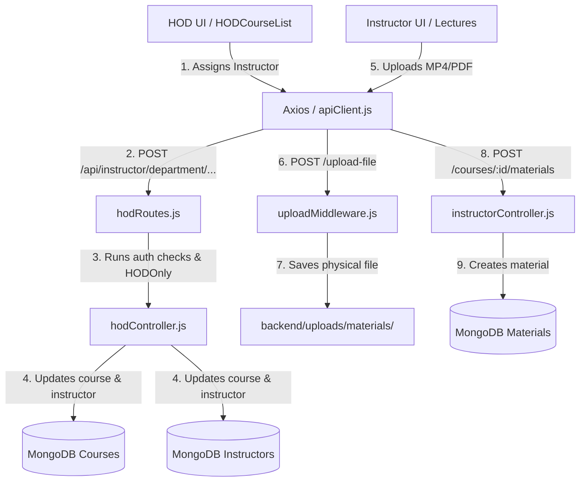

# Seliem's Modules: Instructor & Head of Department (HOD) Portals

This document details Seliem's specific modules of the EduCore LMS application, their CommonJS architecture, and crucial instructor/HOD workflow implementations.

This document explains what Seliem's parts of the application do and how they function.

---

## 👨‍🏫 1. Instructor Assignments & Grading Panel

- **What it does**: Allows instructors to create assignments for their courses, toggle assignments between "Open" and "Closed" states, view a full roster of student submissions, download submitted files, and grade submissions with qualitative feedback.
- **Key Files**:
  - [InstructorAssignmentPanel.jsx](file:///c:/Users/Dell/Desktop/web_project/frontend/src/pages/instructor/InstructorAssignmentPanel.jsx) (Assignment CRUD, submissions roster, grading modals)
  - [instructorController.js](file:///c:/Users/Dell/Desktop/web_project/backend/controllers/instructorController.js) (Backend logic for creating assignments, listing assignments, getting submissions, grading, and status toggles)
  - [Assignment.js](file:///c:/Users/Dell/Desktop/web_project/backend/models/Assignment.js) (Added status string field)
- **How it works**:
  - **Assignment Creation**: Instructors fill out a modal specifying the title, description, deadline, total marks, and target course. The backend validates permissions, creates the assignment document, and inserts notifications for all active student enrollments.
  - **Status Control**: Instructors can close/open assignments. This updates `status` in the DB, and prevents students from submitting work past the deadline if closed.
  - **Full-Roster Submissions View**: The page retrieves all active student enrollments for the course and compares them against submissions, showing a table of who submitted, submission dates, grades, and feedback.
  - **Grading & Feedback**: Instructors enter grades and feedback. Submitting triggers an update in `AssignmentSubmission` and pushes a dynamic Notification document to the student.

## 📚 2. Course Lectures & Materials Manager (with File Upload)

- **What it does**: Enables instructors to manage syllabus content by uploading lectures/materials (PDF, MP4, Doc, PPT, or links) categorized by semester week, with duration limits and publish/draft toggles.
- **Key Files**:
  - [InsideCourseLectures.jsx](file:///c:/Users/Dell/Desktop/web_project/frontend/src/pages/instructor/InsideCourseLectures.jsx) (Lecture manager UI, file uploader zone, deletion checks)
  - [uploadMiddleware.js](file:///c:/Users/Dell/Desktop/web_project/backend/middleware/uploadMiddleware.js) (Multer configuration for 100MB lecture files)
  - [Material.js](file:///c:/Users/Dell/Desktop/web_project/backend/models/Material.js) (Added week, duration, file_type, and status schemas)
- **How it works**:
  - **Uploading Materials**: Instructors drop files into the uploader or enter links. The file is sent via `POST /api/instructor/upload-file` utilizing `multer`. It validates that the file is under 100MB and matches allowed formats (PDF, MP4, DOC, PPTX, etc.).
  - **Lecture Creation**: A secondary API call (`POST /api/instructor/courses/:courseId/materials`) saves the lecture details (week, title, duration, status, and upload file path) to MongoDB.
  - **Retrieval and Deletion**: Lectures are grouped and sorted by week. Instructors can permanently delete materials from the database.

## 📊 3. HOD Dashboard & Departmental Overview

- **What it does**: Provides Head of Department (HOD) users with a centralized overview of their department's metrics (total courses, active assignments, instructor counts, teaching tasks, and pending reviews).
- **Key Files**:
  - [DepartmentHeadDashboard.jsx](file:///c:/Users/Dell/Desktop/web_project/frontend/src/pages/instructor/DepartmentHeadDashboard.jsx) (Main HOD shell layout and tab-based navigation)
  - [HODDashboard.jsx](file:///c:/Users/Dell/Desktop/web_project/frontend/src/pages/hod/HODDashboard.jsx) (Statistics overview widgets)
  - [hodController.js](file:///c:/Users/Dell/Desktop/web_project/backend/controllers/hodController.js) (Department-specific database queries)
- **How it works**:
  - Reads the HOD's department from their authenticated user profile (`req.user.department`).
  - Queries courses, instructors, and teaching tasks belonging exclusively to that department.
  - Aggregates and displays the results in interactive dashboard widgets with high-fidelity styles.

## 🔌 4. HOD Instructor Workload & Assignment Panel

- **What it does**: Allows the HOD to audit the teaching workload of instructors within their department, calculate teaching metrics, and assign/remove instructors from department courses.
- **Key Files**:
  - [HODCourseList.jsx](file:///c:/Users/Dell/Desktop/web_project/frontend/src/pages/hod/HODCourseList.jsx) (Course assignment UI)
  - [HODAssignInstructor.jsx](file:///c:/Users/Dell/Desktop/web_project/frontend/src/pages/hod/HODAssignInstructor.jsx) (Instructor selection modal)
  - [HODInstructorList.jsx](file:///c:/Users/Dell/Desktop/web_project/frontend/src/pages/hod/HODInstructorList.jsx) & [HODInstructorWorkload.jsx](file:///c:/Users/Dell/Desktop/web_project/frontend/src/pages/hod/HODInstructorWorkload.jsx) (Workload summary cards)
- **How it works**:
  - **Workload Analysis**: The backend iterates over department instructors, queries courses where `assigned_instructors` includes their ID, and calculates total course count, accumulated credit hours, and total enrolled students.
  - **Instructor Assignment**: The HOD opens the modal on a course, chooses an instructor, and saves. The backend updates the `assigned_instructors` array on the `Course` model and updates the `assigned_courses` array on the `Instructor` model to ensure data synchronicity.

## 📝 5. HOD Specialized Teaching Tasks & Profile

- **What it does**: Allows the HOD to assign and manage specific teaching tasks (matching courses and instructors to particular student years and specializations) and edit their own public HOD profile.
- **Key Files**:
  - [TeachingTask.js](file:///c:/Users/Dell/Desktop/web_project/backend/models/TeachingTask.js) (Database model for teaching assignments)
  - [HODProfilePage.jsx](file:///c:/Users/Dell/Desktop/web_project/frontend/src/pages/hod/HODProfilePage.jsx) (Profile updating form)
- **How it works**:
  - **Teaching Tasks**: HOD registers specialized teaching duties (e.g. Course X for AI specialization, Sophomore year, Instructor Y). The system stores this in the `TeachingTask` collection, populating descriptions for list views.
  - **HOD Profile**: HOD updates their details (bio, office hours, location, phone) directly in the `Instructor` collection.

---

## 📚 6. Study & Viva Guide (Instructor & HOD Portals)

This guide helps you master Seliem's specific modules and confidently navigate the codebase during your viva.

### 🗂️ A. How to Traverse Your Codebase Instantly

If the professor asks you about any HOD or instructor feature, explain this traversal path:

1. **Frontend Entry**: Look in [App.jsx](file:///c:/Users/Dell/Desktop/web_project/frontend/src/App.jsx) to locate Seliem's client routes:
   - `/department-head` loads [DepartmentHeadDashboard.jsx](file:///c:/Users/Dell/Desktop/web_project/frontend/src/pages/instructor/DepartmentHeadDashboard.jsx) (HOD shell)
   - `/instructor/assignments` loads [InstructorAssignmentPanel.jsx](file:///c:/Users/Dell/Desktop/web_project/frontend/src/pages/instructor/InstructorAssignmentPanel.jsx)
   - `/instructor/course/:courseId/lectures` loads [InsideCourseLectures.jsx](file:///c:/Users/Dell/Desktop/web_project/frontend/src/pages/instructor/InsideCourseLectures.jsx)
2. **API Endpoint Call**: Inside the frontend file, find the Axios call (e.g. `apiClient.get('/api/instructor/department/courses')`).
3. **Backend Route Mapping**: Open [server.js](file:///c:/Users/Dell/Desktop/web_project/backend/server.js) to show route bindings:
   - `/api/instructor/department` maps to [hodRoutes.js](file:///c:/Users/Dell/Desktop/web_project/backend/routes/hodRoutes.js)
   - `/api/instructor` maps to [instructorRoutes.js](file:///c:/Users/Dell/Desktop/web_project/backend/routes/instructorRoutes.js)
4. **Backend Controllers**:
   - For HOD actions, open [hodController.js](file:///c:/Users/Dell/Desktop/web_project/backend/controllers/hodController.js) (contains department-specific stats, assignments, tasks, profiles)
   - For Instructor actions, open [instructorController.js](file:///c:/Users/Dell/Desktop/web_project/backend/controllers/instructorController.js)
5. **Database Models**: Open [backend/models/](file:///c:/Users/Dell/Desktop/web_project/backend/models) to inspect structures:
   - [TeachingTask.js](file:///c:/Users/Dell/Desktop/web_project/backend/models/TeachingTask.js) (Specialized HOD teaching assignments)
   - [Material.js](file:///c:/Users/Dell/Desktop/web_project/backend/models/Material.js) (Syllabus/Lectures database records)
   - [Assignment.js](file:///c:/Users/Dell/Desktop/web_project/backend/models/Assignment.js) & [AssignmentSubmission.js](file:///c:/Users/Dell/Desktop/web_project/backend/models/AssignmentSubmission.js)

### 📁 Complete File Inventory
The following files are owned/authored by Seliem:
- **Frontend Shared Layout**:
  - [InstructorLayout.jsx](file:///c:/Users/Dell/Desktop/web_project/frontend/src/layouts/InstructorLayout.jsx)
  - [HODLayout.jsx](file:///c:/Users/Dell/Desktop/web_project/frontend/src/layouts/HODLayout.jsx)
- **Frontend Pages & Components**:
  - [InstructorDashboard.jsx](file:///c:/Users/Dell/Desktop/web_project/frontend/src/pages/instructor/InstructorDashboard.jsx)
  - [InstructorGlobalStreamPage.jsx](file:///c:/Users/Dell/Desktop/web_project/frontend/src/pages/instructor/InstructorGlobalStreamPage.jsx)
  - [InstructorProfilePage.jsx](file:///c:/Users/Dell/Desktop/web_project/frontend/src/pages/instructor/InstructorProfilePage.jsx)
  - [InsideCourseLectures.jsx](file:///c:/Users/Dell/Desktop/web_project/frontend/src/pages/instructor/InsideCourseLectures.jsx)
  - [InsideCourseStream.jsx](file:///c:/Users/Dell/Desktop/web_project/frontend/src/pages/instructor/InsideCourseStream.jsx)
  - [CreateCourseStep1.jsx](file:///c:/Users/Dell/Desktop/web_project/frontend/src/pages/instructor/CreateCourseStep1.jsx)
  - [CreateCourseStep2.jsx](file:///c:/Users/Dell/Desktop/web_project/frontend/src/pages/instructor/CreateCourseStep2.jsx)
  - [InstructorAssignmentPanel.jsx](file:///c:/Users/Dell/Desktop/web_project/frontend/src/pages/instructor/InstructorAssignmentPanel.jsx)
  - [InstructorAnalytics.jsx](file:///c:/Users/Dell/Desktop/web_project/frontend/src/pages/instructor/InstructorAnalytics.jsx)
  - [DepartmentHeadDashboard.jsx](file:///c:/Users/Dell/Desktop/web_project/frontend/src/pages/instructor/DepartmentHeadDashboard.jsx)
- **Backend Controllers & Routes**:
  - [instructorController.js](file:///c:/Users/Dell/Desktop/web_project/backend/controllers/instructorController.js)
  - [hodController.js](file:///c:/Users/Dell/Desktop/web_project/backend/controllers/hodController.js)
  - [instructorRoutes.js](file:///c:/Users/Dell/Desktop/web_project/backend/routes/instructorRoutes.js)
  - [hodRoutes.js](file:///c:/Users/Dell/Desktop/web_project/backend/routes/hodRoutes.js)

### 🗺️ B. Detailed Feature Maps (Your Part vs. Other Parts)

Use this table to verify what is **your ownership (Seliem)**. If the professor asks you about any topic in the "Not Your Part" column, state: **"This part was implemented by my colleague; they can explain their files and architecture."**

| System Domain | 👨‍🏫 YOUR Part (Seliem) | ❌ NOT Your Part (Colleagues) |
|---|---|---|
| **HOD Operations** | Department course lists, assigning/removing instructors, teaching workloads, specialized teaching tasks, HOD profile updates. | Global system configurations, log audits, user creation/deletion (Jonathan / Yassin). |
| **Instructor Actions** | Creating assignments, toggling assignment statuses, viewing full submission rosters, grading, uploading/deleting lectures. | Course registration UI for students, student dashboard, student profile views (Magdy). |
| **Database Models** | `TeachingTask` model, `Material` fields (week, duration, file_type, status), `Assignment` status field, `Instructor` profile additions. | `Student` profile, `Admin` model, `SystemLog` model (Magdy / Jonathan). |
| **Upload Pipelines** | 100MB lecture file upload pipeline (`uploadFile`) stored in `uploads/materials/`. | 10MB assignment submission upload pipeline, 2MB user avatars upload pipeline (Jonathan). |
| **UI Components** | HOD Dashboard pages, Instructor assignment panel, Course lectures panel, Sidebar logout integration. | System settings page, inbox chat views, skeleton loading elements (Jonathan / Basel). |

### 🔄 C. Step-by-Step Data Flow

Here is how data flows through Seliem's key features:

#### Example 1: Uploading a Lecture File
1. **Frontend Upload**: The instructor selects a file (e.g. `lecture1.mp4`) in [InsideCourseLectures.jsx](file:///c:/Users/Dell/Desktop/web_project/frontend/src/pages/instructor/InsideCourseLectures.jsx).
2. **File Dispatch**: The frontend builds a `FormData` object and triggers a `POST` request to `/api/instructor/upload-file`.
3. **Backend Middleware**: Express routes the request to [uploadMiddleware.js](file:///c:/Users/Dell/Desktop/web_project/backend/middleware/uploadMiddleware.js)'s `uploadFile` handler. It parses the multipart data, saves the file to `backend/uploads/materials/` using a unique timestamped name, and returns the file path to the client.
4. **Lecture Creation**: The frontend sends a second JSON payload containing the lecture title, week, type, duration, status, and the returned file URL to `/api/instructor/courses/:courseId/materials`.
5. **Database Storage**: The controller `addCourseMaterial` in [instructorController.js](file:///c:/Users/Dell/Desktop/web_project/backend/controllers/instructorController.js) creates a document in the `Material` collection.
6. **Refreshed View**: The frontend catches a successful status (201) and triggers a re-fetch of course materials to display the new lecture list.

#### Example 2: Assigning an Instructor to a Course (HOD)
1. **Frontend Action**: In the HOD Courses tab (`HODCourseList.jsx`), the HOD clicks "Assign Instructor" on a course and selects an instructor.
2. **API Dispatch**: The page sends a `POST` request to `/api/instructor/department/courses/:courseId/assign` containing the `{ instructorId }`.
3. **Security Guard**: `hodRoutes.js` intercepts. It verifies the HOD session (`protect` middleware) and confirms their role is `head_of_department` (`HODOnly` middleware).
4. **Departmental Check**: The controller `assignInstructorToCourse` in [hodController.js](file:///c:/Users/Dell/Desktop/web_project/backend/controllers/hodController.js) checks that both the course and the instructor belong to the HOD's department (`req.user.department`).
5. **Synchronous Updates**: The backend updates the `assigned_instructors` array of the `Course` document AND the `assigned_courses` array of the `Instructor` document.
6. **Success Alert**: The backend replies with a success message, and the frontend updates the instructor assignment badge using a global toast alert.

### 🗂️ D. Database Structure & Important/Tough Spots

- **HOD Route Matching Precedence**:
  - Because Seliem's HOD routes are registered under `/api/instructor/department` and standard instructor routes are registered under `/api/instructor`, path registration ordering is critical. In `server.js`, the HOD routes route handler `app.use('/api/instructor/department', hodRoutes)` must be registered **before** `app.use('/api/instructor', instructorRoutes)`. If it were registered after, Express's prefix matcher would mistake `/api/instructor/department/...` for `/api/instructor/:id/...` or a generic endpoint, causing 404 or authorization failures.
- **Bi-directional Mongoose References**:
  - To maintain fast indexing and query speeds, Seliem's system uses bi-directional relationships. When an instructor is assigned to a course, their ID is pushed to `Course.assigned_instructors` AND the course ID is pushed to `Instructor.assigned_courses`. This requires the controller to execute two database updates synchronously (`course.save()` and `instructor.save()`).
- **Full-Roster Assignment Audits**:
  - Instead of only returning active student submissions, `getAssignmentSubmissions` in [instructorController.js](file:///c:/Users/Dell/Desktop/web_project/backend/controllers/instructorController.js) pulls all active `Enrollment` records for a course and performs an outer-join in memory with `AssignmentSubmission` records. This ensures instructors see a list of ALL students, including those who have **not** submitted yet, rather than only those who have.

### 🎙️ E. Top 5 Questions Your Professor Might Ask

1. **"Why did you register the HOD routes BEFORE the Instructor routes in server.js?"**
   - _Answer_: Express parses routes in sequential order. Since the HOD path starts with `/api/instructor/department` and standard instructor routes start with `/api/instructor`, placing instructor routes first would cause Express to intercept department requests and route them to instructor handlers, resulting in route mismatch errors.
2. **"What precautions did you take in uploadMiddleware.js for lecture materials?"**
   - _Answer_: We configured a dedicated `uploadFile` Multer storage instance with a file size limit of 100MB (to allow video lectures). We restricted acceptable file formats via a `fileFilter` to PDF, MP4, DOC, DOCX, PPT, and PPTX to prevent users from uploading executable files (`.exe`, `.js`) that could compromise server security.
3. **"How does the workload calculator for department instructors gather its metrics?"**
   - _Answer_: Inside `getDepartmentInstructors` in `hodController.js`, the code fetches all instructors in the HOD's department. For each instructor, it queries the `Course` collection to find courses where `assigned_instructors` includes their ID, and sums up the credit hours and enrolled student counts to build the workload profile dynamically.
4. **"How did you implement the outer-join to show student assignment submission statuses?"**
   - _Answer_: We first query all active enrollments for the course from the `Enrollment` model and populate student details. We then query all submission documents for the assignment from the `AssignmentSubmission` model. In the controller, we map the enrollment array and check if a submission document exists for each student, dynamically flagging their status as 'Submitted' or 'Not Submitted'.
5. **"Why does the HOD dashboard use an inline sidebar instead of the global Sidebar component?"**
   - _Answer_: The HOD portal is structured as a Single Page dashboard (`DepartmentHeadDashboard.jsx`) that uses internal tab state (`activeTab`) to switch between Overview, Courses, Teaching Tasks, Workloads, and Profile. This avoids full page reloads, providing a faster and smoother administrative experience.

---

# 🗺️ SECTION 1 — My Code: Big Picture Overview

In the lifecycle of a learning management system, the academic experience is driven by course instructors and department leaders. Seliem's code implements the administrative portal for department chairs (HODs) and the course content management dashboard for faculty instructors.

## What Problem My Code Solves

1. **Academic Stewardship**: HODs need a way to assign instructors to syllabus courses, audit teaching loads, and assign specialized tasks matching specialization fields.
2. **Lecture Distribution**: Instructors need file upload pipelines and structured views to organize and distribute multi-format materials (PDF slides, MP4 lecture recordings, external document templates) sorted by weeks.
3. **Gradebooks & Deliverables**: Instructors need assignment creators that notify enrolled students, along with a full-roster evaluation sheet to read submissions, download homework files, and save grades.
4. **HOD Profile Hub**: Instructors and students need to know when and where to contact the HOD (office hours, location details), which the HOD can modify dynamically.

## How My Frontend and Backend Connect

The HOD and instructor dashboards communicate with the API layer using the Axios-based `apiClient.js`:

- **Lecture Upload Pipeline**: The client triggers a multipart file upload (`/api/instructor/upload-file`). The backend saves the physical file in `uploads/materials/` and responds with the URL. The client then issues a JSON `POST` request to `/api/instructor/courses/:courseId/materials` with the file metadata to save it in MongoDB.
- **Dynamic Grading Flow**: When an instructor enters grades, they issue a `PUT` request to `/api/instructor/submissions/:id/grade`. The backend updates the submission grade, creates a notification for the student, and returns the updated roster state.
- **HOD Assignments**: HOD inputs are saved by posting to `/api/instructor/department/courses/:courseId/assign`. The backend runs security checks and updates the Mongoose documents, and the frontend updates the status tags.

## How My Code Interacts with Colleagues' Parts

Seliem's portals serve as the bridge between administrative management and student progress:

1. **Magdy's Student Experience**: When Seliem's instructor portals publish assignments or upload lecture files, Magdy's student portals receive these updates instantly. The student downloads Seliem's uploaded files and submits assignments that appear on Seliem's grading board.
2. **Jonathan's Security Framework**: Seliem's routes run behind Jonathan's authentication cookies, rate-limit maps, and CSRF token header comparisons.
3. **Yassin's User and Course Systems**: Seliem's HOD tools pull courses and instructors created by Yassin's panels, allowing HODs to link them together in the database.
4. **Basel's Messaging Inbox**: Seliem's HOD workload cards list direct shortcuts to trigger chat windows in Basel's messaging page.

## Architecture and Data-Flow Diagram



---

# 🔍 SECTION 2 — Deep Code Explanation

Detailed file-by-file analysis of Seliem's backend code and frontend component implementations.

## 🛠️ 1. Backend Route Definitions & Middlewares

### 📄 `backend/routes/hodRoutes.js`
- **Purpose**: Defines route urls for HOD functions and registers the `HODOnly` middleware guard.
- **Details**:
  - Registers the global `protect` middleware to ensure the caller has a valid JWT session.
  - Registers `HODOnly`: Checks `req.user.role === 'head_of_department'`. If not, blocks the request with a 403 Forbidden status.
  - Exposes 9 endpoints covering course listings, assignment configurations, teaching tasks, and profiles.

### 📄 `backend/middleware/uploadMiddleware.js` (Seliem's Additions)
- **Purpose**: Implements custom file upload pipelines using Multer.
- **Details**:
  - `uploadFile`: Handles lecture file uploads. Specifies `uploads/materials/` as the storage target. Generates unique file names using timestamps and random numbers to prevent name conflicts. Sets a size limit of 100MB to allow video recordings.
  - Limits file formats to PDF, MP4, DOC, DOCX, PPT, and PPTX to block unauthorized file uploads.

---

## 🗄️ 2. Backend Controllers & Models

### 📄 `backend/controllers/hodController.js`
- **Purpose**: Handles departmental data aggregation and assignments.
- **Key Functions**:
  - `getDepartmentInstructors`: Queries department instructors. For each instructor, it aggregates their assigned courses, calculates total credit hours, and counts enrolled students, building a teaching workload report.
  - `assignInstructorToCourse` / `removeInstructorFromCourse`: Updates the relationship arrays on the `Course` and `Instructor` models, maintaining synchronous references.
  - `createTeachingTask`: Creates teaching tasks linked to a course and instructor, validation-checked for year groups and specializations.
  - `updateHODProfile`: Saves profile metrics (phone, bio, office hours, location) to the `Instructor` model for the current HOD.

### 📄 `backend/models/TeachingTask.js`
- **Purpose**: Mongoose schema for specialized teaching tasks.
- **Fields**:
  - `course_id` / `instructor_id`: ObjectIds referencing the Course and Instructor collections.
  - `course_name` / `course_code` / `doctor_name`: De-normalized string fields for fast reads.
  - `year`: Enum validating course level (`Freshman`, `Sophomore`, `Junior`, `Senior`).
  - `specialization`: Enum validating focus area (`AI`, `Cybersecurity`, `Software Engineering`, `Data Science`).

---

## 🎨 3. Frontend Pages & Dashboards

### 📄 `frontend/src/pages/instructor/DepartmentHeadDashboard.jsx`
- **Purpose**: Serving as the structural shell for the HOD portal, implementing the navigation layout and tab rendering.
- **Details**:
  - Implements an internal sidebar layout with 5 navigation links (*Overview, Course Assignments, Teaching Tasks, Instructor Workloads, Profile*).
  - Uses tab-state switches (`activeTab`) to mount Seliem's child dashboards in the details window.
  - Includes a logout handler that calls the shared auth context.

### 📄 `frontend/src/pages/instructor/InstructorAssignmentPanel.jsx`
- **Purpose**: Provides instructors with tools to manage assignments and evaluate submissions.
- **Details**:
  - Lists all assignments with live submission counters (e.g. `12 / 30 submitted`).
  - Includes a "Create Assignment" modal that builds payload requests.
  - Includes a "View Submissions" modal that aggregates the student roster, submission status, and upload details.
  - Includes a "Grade Submission" modal for instructors to grade submissions and provide qualitative feedback.
  - Implements an "Open/Closed" toggle to enable/disable submissions.

### 📄 `frontend/src/pages/instructor/InsideCourseLectures.jsx`
- **Purpose**: Syllabus lecture and materials manager dashboard.
- **Details**:
  - Groups uploaded files and links by week.
  - Includes a file drag-and-drop zone with progress states.
  - Allows deleting materials, showing confirmation alerts, and sending DELETE requests to clean the database and file system.

---

# 📚 SECTION 3 — Study Guide: Master My Part

## 🔑 Key Concepts & Technologies Explained

1. **Bi-directional References Integrity**
   - _Concept_: When database models point to each other (e.g., Course lists Instructors and Instructor lists Courses), modifying one requires updating both. If you only update one, the database will be out of sync. Seliem's code handles this by executing updates on both models inside assignment controller calls.
2. **Tab-based Shell Architecture**
   - _Concept_: Instead of routing each sub-page to a new URL, the HOD dashboard uses a tabbed structure. This keeps the application fast and responsive by switching view states in memory rather than forcing full page transitions.
3. **Mongoose Populates and Sub-Queries**
   - _Concept_: Mongoose's `.populate()` method replaces ObjectId fields with full documents from other collections. This is used in HOD workload tables and assignment submission pages to pull instructor names, student emails, and course titles.

---

## 📖 Glossary of Terms

- **HOD (Head of Department)**: An administrative user role that oversees departmental courses, instructors, and teaching workloads.
- **Multer**: Node.js middleware for parsing `multipart/form-data` request bodies, used to handle file uploads.
- **Outer-Join**: A database query pattern that returns all records from one collection and matching records from another. In Seliem's code, this is used to list all enrolled students and show whether they have submitted an assignment.
- **Enum (Enumeration)**: A validation schema constraint that restricts a field to a predefined set of string values (e.g., Sophomore/Junior, AI/Cybersecurity).

---

## 🔄 Core Flow Walkthroughs

### Flow 1: Instructor Grading Submissions
```
[Instructor clicks Grade] ---> [Enters Marks & Feedback] ---> PUT /api/instructor/submissions/:id/grade
                                                                                    |
  [Student Dashboard] <--- Triggers Notification document <--- [Updates Submission Status in MongoDB]
```
1. The instructor selects a student submission in the roster table and clicks "Grade".
2. They enter a score and feedback in the modal and submit.
3. Axios sends a `PUT` request to `/api/instructor/submissions/:id/grade`.
4. The controller `gradeSubmission` saves the grade and feedback, and creates a document in the `Notification` collection.
5. The student receives the notification next time their client fetches updates.

---

## 💡 Gotchas & Edge Cases to Know

- **Multer File Size Limits**: The upload handler has a 100MB limit for video lectures. Uploading a larger file will result in a payload error.
- **Double-Save Failures**: In `assignInstructorToCourse`, if saving the Course document succeeds but saving the Instructor document fails, the database will be out of sync. In production, this should be wrapped in a transaction session.
- **Path Conflict Prevention**: HOD routes must be registered before general instructor routes in `server.js` to prevent route collision.

---

## ❓ Study Questions & Answers

1. **"How does the HOD dashboard determine what courses and instructors to list?"**
   - _Answer_: It checks the authenticated HOD's department (`req.user.department`). It then queries the database for courses and instructors that match this department.
2. **"How do you prevent students from submitting assignments if they are closed?"**
   - _Answer_: Seliem's assignment model includes a `status` field (`Open` or `Closed`). When a student attempts to submit an assignment, the system validates that the status is `Open` before processing the upload.
3. **"What happens to the physical file on the server when a lecture is deleted?"**
   - _Answer_: The delete API clears the document from the `Material` collection in MongoDB. In a production system, this should also delete the physical file from the `uploads/materials/` folder on disk.

---

# 🎤 SECTION 4 — Presentation & Demo Prep

## 60-Second Elevator Pitch

> "I built the Instructor and Head of Department portals for the EduCore LMS. I developed the HOD dashboard, which allows department chairs to assign instructors to courses, track teaching workloads, and configure specialized teaching tasks. For instructors, I built assignment management tools, a full-roster grading panel, and a weekly lecture uploads system that supports multi-format file uploads of up to 100MB. This provides our faculty and department leads with a complete, secure system to manage courses and evaluate student progress."

---

## 🖥️ Step-by-Step Demo Script

```
[Login as HOD] ---> [Assign Instructor] ---> [View Workloads] ---> [Log in as Instructor] ---> [Upload Lecture]
```

1. **Step 1: HOD Dashboard & Assignments**
   - _Action_: Log in as an HOD user and open the Course Assignments tab.
   - _Talking Points_: _"Here, the HOD can see all courses in their department. I can assign a faculty member to a course using this modal. This updates the relationship across both the Course and Instructor documents in the database."_
2. **Step 2: Instructor Workload Audit**
   - _Action_: Open the Instructor Workloads tab.
   - _Talking Points_: _"The system calculates teaching metrics dynamically, displaying the number of assigned courses, credit hours, and total enrolled students for each instructor in the department."_
3. **Step 3: Instructor Course Material Management**
   - _Action_: Log in as an instructor, navigate to a course, and open the Lectures tab.
   - _Talking Points_: _"Instructors can upload course materials, such as PDFs or video lectures, by dragging and dropping them into this zone. Files are validated, stored on the server, and organized by week."_
4. **Step 4: Roster-wide Grading**
   - _Action_: Open the assignments tab and click "View Submissions" on an assignment.
   - _Talking Points_: _"Instructors can view all enrolled students and see who has submitted their work. We can download submitted files, enter a grade, and leave feedback, which automatically notifies the student."_

---

## ⚙️ Technical Choices

### 1. Removing Mock Data & Integrating MongoDB
Seliem's original code included an offline mock fallback system (`mockData.js`). During integration, we removed the mock system to ensure the application runs exclusively on MongoDB. This ensures all dashboard metrics, course lists, lecture items, and assignment submissions are fetched from the database, preventing data synchronization issues.

### 2. Multer Configuration for Course Materials
We configured Multer with a 100MB file size limit and strict format filters (PDF, MP4, DOC, DOCX, PPT, PPTX) to support video lectures while protecting the server from unauthorized file uploads.

### 3. HOD Route Registration
HOD routes are registered under `/api/instructor/department` before standard instructor routes under `/api/instructor` in `server.js` to prevent route collision.

---

# 📦 Dependencies and Running

### 1. Library Dependencies Installed
- **`multer`**: Handles multipart/form-data for lecture uploads.
- **`express`**: Web framework for routing and middleware.
- **`mongoose`**: ODM for MongoDB schema design and queries.

### 2. How to Run Seliem's Portals
1. Navigate to the frontend directory: `cd frontend`
2. Start the Vite development server: `npm run dev`
3. Navigate to the backend directory: `cd backend`
4. Start the Express API server: `npm run dev` (runs Nodemon)
5. Log in using an HOD account (role: `head_of_department`) or an instructor account (role: `instructor`).

---

## 🤖 AI Backend Generator Prompt
If you want to re-generate or extend the backend task using an AI, copy and paste the following prompt:

```text
Act as a senior full-stack JavaScript developer. You are running as an AI agent integrated directly inside my code editor workspace. I need you to use your file editing and creation tools to directly implement the backend integration and additional API endpoints for the Instructor Portal of our web application. I do not understand databases, MVC architecture, or backend coding, so please do not give me code blocks to copy and paste. Instead, perform the changes directly in the workspace files yourself and explain what you did in simple terms.

Here is the context of our application:
1. Tech Stack: React (frontend), Node.js + Express (backend), MongoDB + Mongoose (database).
2. Authentication: Cookie-based sessions. The server sets a secure `jwt` cookie upon login.
3. Security: Double-Submit Cookie CSRF protection is active. Every modifying request (POST, PUT, DELETE) must check that the `csrf-token` cookie value matches the `X-CSRF-Token` header.
4. Client: The frontend uses an axios instance located at `frontend/src/lib/apiClient.js` which automatically forwards credentials and sets CSRF headers.
5. Toast System: The frontend has a Toast Context. We can trigger alerts using:
   const { showToast } = useToast();
   showToast("Message", "success" | "error");

Here are the frontend views I have created:
1. InstructorDashboard.jsx (needs real stats: active courses, total student count, average ratings, recent submissions)
2. CreateCourseStep1.jsx & CreateCourseStep2.jsx (needs to submit title, category, level, description, start/end dates, capacity, language, and upload a cover image)
3. InsideCourseLectures.jsx (needs to fetch a course's lectures/materials, and submit new lecture rows)
4. InsideCourseStream.jsx (needs to fetch announcements and post new comments)
5. InstructorAssignmentPanel.jsx (needs to list course assignments, show submission counts, and open a portal to grade submissions)
6. InstructorGlobalStreamPage.jsx (needs to fetch recent activity across all courses, write announcements, and post comments/replies)
7. InstructorProfilePage.jsx (needs to fetch details like bio/office hours, and submit details updates)

Here is what is already in our backend:
- backend/routes/instructorRoutes.js (registers endpoints: GET /courses, POST /assignments, GET /assignments/:id/submissions, PUT /submissions/:id/grade, POST /quizzes, POST /materials)
- backend/controllers/instructorController.js (contains functions: getInstructorCourses, createAssignment, getAssignmentSubmissions, gradeSubmission, createQuiz, uploadMaterial)

Please directly perform the following tasks in the workspace:
1. Create/write the new controller functions and routes for:
   - Updating the instructor's profile bio, display name, office hours, and contact details (updating the Instructor model).
   - Fetching and creating course announcements/streams.
   - Managing lectures (retrieving and posting course materials).
2. Directly update and integrate the React frontend code for ALL of my pages (InstructorDashboard, CreateCourseStep1 & Step2, InsideCourseLectures, InsideCourseStream, InstructorAssignmentPanel, InstructorGlobalStreamPage, InstructorProfilePage) by replacing the static mock data with live apiClient requests, updating state hooks on load, adding loading spinner/skeleton indicators, and using the toast alert systems for success/error handling.
3. Keep all of our Tailwind styling, transitions, glassmorphic themes, and responsive design layouts exactly the same. Do not write placeholder code; write fully production-ready code.
```
